# SIMRS Campus UEU — Project Charter

- **Status:** Approved working baseline
- **Approval date:** 2026-07-15
- **Product stage:** Discovery and foundation planning
- **Initial release type:** University teaching and simulation platform

## 1. Why this project exists

Universitas Esa Unggul needs a shared campus hospital information system where health-sciences students can learn realistic hospital workflows around the same synthetic patient. The system should connect professional work instead of presenting each study program with an isolated collection of forms.

The product is intended to help students understand:

- how information moves across a hospital;
- what each profession records, reads, and hands over;
- how documentation affects care, medication, coding, completeness, billing simulation, and reporting;
- which actions require authorization or supervisor review;
- how interprofessional decisions become one longitudinal patient record.

## 2. Product boundary

The first product is a **teaching and simulation system**, not a live clinical-care electronic medical record.

| Boundary | Approved position |
|---|---|
| Patient data | Synthetic patients only |
| Clinical use | Teaching and simulation; no real treatment decisions |
| Primary interface language | Indonesian, with recognized clinical/technical terminology where appropriate |
| Student work | Drafted by students and reviewed or approved by an authorized lecturer/supervisor |
| External systems | BPJS and SATUSEHAT simulation or approved sandbox connections only |
| Initial hosting | Hostinger, conditional on technical preflight and a documented migration trigger |
| Legacy application | Reference mock-up only; no code or database migration requirement |

## 3. First pilot

The first pilot is one complete **outpatient patient journey** involving four programs:

1. Medicine
2. Nursing
3. Medical Records and Health Information (RMIK)
4. Pharmacy

Nutrition, psychology, and physiotherapy remain part of the product vision and will be introduced in later multidisciplinary increments after the shared patient, encounter, authorization, audit, and supervision foundations are proven.

## 4. Pilot journey

The first synthetic patient should be able to move through this sequence:

```mermaid
flowchart LR
    A["Teaching scenario assigned"] --> B["Patient registration"]
    B --> C["Nursing triage"]
    C --> D["Medical assessment"]
    D --> E["Diagnosis and orders"]
    E --> F["Results reviewed"]
    F --> G["Prescription"]
    G --> H["Pharmacy verification and dispensing"]
    H --> I["Encounter closure"]
    I --> J["RMIK completeness and coding review"]
    J --> K["Supervisor approval and debrief"]
```

The workshop may refine this order, but it must preserve one shared patient and encounter context across all participating roles.

## 5. Intended users

- Students acting within assigned professional roles
- Lecturers and clinical supervisors
- Simulation facilitators and scenario authors
- Registration and RMIK teaching roles
- Pharmacy teaching roles
- System administrators and authorized auditors

Access is not based on job title alone. It must also consider the course, cohort, simulation session, assigned patient, encounter, discipline, supervision relationship, and document sensitivity.

## 6. Pilot success criteria

The first pilot is successful when:

1. one synthetic patient completes the outpatient journey without switching to disconnected mock applications;
2. each of the four programs can perform its authorized work and see the information needed from earlier steps;
3. student entries preserve author, time, role, state, and revision history;
4. lecturers can request corrections and approve work without overwriting the original entry;
5. unauthorized role and context combinations are denied and tested;
6. RMIK can identify incomplete or unsigned documentation and complete coding review;
7. learners and instructors can debrief the full event history;
8. the interface clearly identifies the system and data as simulation;
9. the workflow passes faculty acceptance using an agreed test scenario;
10. a deployment and rollback rehearsal succeeds on staging.

## 7. Explicit non-goals for the pilot

- Real patient care or real patient records
- Production BPJS, SATUSEHAT, payment, laboratory, or other clinical integration
- Complete inpatient, emergency, operating-theatre, intensive-care, nutrition, psychology, or physiotherapy modules
- Recreating every menu from the legacy mock-up
- Migrating legacy code, database records, credentials, or browser-local configuration
- Advanced executive dashboards before trustworthy transactional data exists
- Mobile applications or offline synchronization

## 8. Working principles

- Build vertical patient journeys, not isolated screens.
- Use synthetic data from the first test to the classroom environment.
- Make student supervision part of the domain model.
- Preserve provenance and amendments; do not silently overwrite clinical records.
- Display simulation, sandbox, and future production states honestly.
- Validate clinical workflow with the relevant program representatives.
- Release incrementally through reviewed GitHub changes and tested staging deployments.
- Keep architecture proportional to the team: begin with a modular monolith and revisit only when measured constraints justify it.

## 9. Recorded decisions

| ID | Decision | Status |
|---|---|---|
| D-001 | The initial product is a teaching/simulation platform using synthetic patients. | Approved |
| D-002 | The first complete vertical slice is outpatient care. | Approved |
| D-003 | Student documentation uses draft, review, correction, and approval states. | Approved |
| D-004 | Medicine, nursing, RMIK, and pharmacy participate in the first pilot. | Approved |
| D-005 | Nutrition, psychology, and physiotherapy enter after the common foundation is proven. | Approved |
| D-006 | The legacy system is reference material, not a migration source or remediation workstream. | Approved |
| D-007 | Hostinger is conditional on infrastructure and rollback preflight. | Approved in principle; technical validation pending |

## 10. Next approval gate

The next step is to establish a small multidisciplinary working group. Names are not required immediately; role holders can be identified first.

Required representation:

- product owner;
- technical lead;
- privacy/security owner;
- one workflow representative each from medicine, nursing, RMIK, and pharmacy;
- one teaching/simulation representative;
- later consultation contacts for nutrition, psychology, and physiotherapy.

The working group’s first deliverable will be one approved outpatient service blueprint and acceptance-scenario catalogue.

## 11. Information still to collect

- Names or roles of the first working-group representatives
- Target student semester and competence level for each program
- Expected number of simultaneous students and classes
- Typical class/simulation duration
- Existing forms, SOPs, rubrics, or course outcomes that should inform the outpatient case
- Available workshop date and format
- Hostinger plan and environment capabilities

## References

- [Campus master plan](SIMRS_CAMPUS_MASTER_PLAN.md)
- [Project start checklist](PROJECT_START_CHECKLIST.md)
- [Legacy assessment](LEGACY_ASSESSMENT.md)
- [ADR-001](adr/ADR-001-REBUILD-ARCHITECTURE.md)

