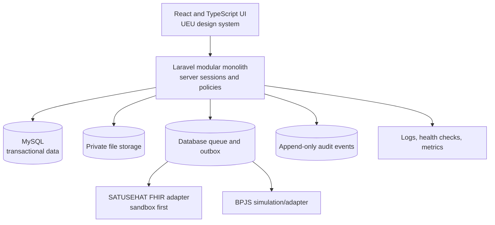

# SIMRS Campus UEU Master Plan

**Version:** 1.0  
**Date:** 15 July 2026  
**Status:** Proposed for cross-program review  
**Product horizon:** Multidisciplinary campus hospital simulation and learning platform

## 1. Executive direction

Build a new system alongside the legacy application.

The target should be a **workflow-faithful campus hospital platform** where students from medicine, nursing, medical records and health information (RMIK), pharmacy, nutrition, psychology, and physiotherapy collaborate around the same synthetic patient journey. It should teach how a hospital works without pretending that simulated BPJS, SATUSEHAT, clinical decisions, signatures, or statistics are real.

The first release is not a licensed production hospital EMR. It is a supervised education system designed with production-grade security, provenance, interoperability boundaries, and hospital logic so that future expansion remains possible.

### Core recommendation

- **Product:** Campus Clinical Simulation + Hospital Information System Learning Platform
- **Build strategy:** Greenfield rebuild; legacy retained as a requirements reference
- **Architecture:** Laravel 13 modular monolith + React/TypeScript, same-origin, MySQL
- **Delivery:** Vertical patient-journey increments, not isolated menu modules
- **Hosting:** Hostinger initially, with explicit capacity/security migration triggers
- **Data posture:** Synthetic data by default; no real patient data in the teaching environment
- **Integration posture:** SATUSEHAT sandbox and BPJS simulation adapters until formal access and governance exist
- **Interaction model:** Student drafts + supervisor review/sign-off + immutable activity trail

## 2. Product north star

> A learner can enter a realistic synthetic case in one professional role, complete their authorized tasks, hand the case to another discipline, and see how every action affects the patient record, operations, coding, medication, billing, quality, and learning outcomes—under visible supervision and without exposing real patient data.

Success is not “many menus.” Success is one coherent encounter that survives every handoff.

## 3. Non-negotiable product posture

### 3.1 Training and clinical truth must be separate

Every environment and record must carry an explicit mode:

- `SIMULATION`: synthetic patient, resettable case, no external production transmission
- `SANDBOX INTEGRATION`: synthetic patient and approved test credentials only
- `PRODUCTION CLINICAL`: future, separate deployment and governance; not part of the initial release

The initial platform supports the first two modes only. `SIMULATION` must be permanently visible in the header, printable documents, exported files, and integration status.

### 3.2 Student work is supervised work

Students do not become unrestricted “doctor”, “nurse”, or “pharmacist” accounts. A permission decision uses:

- profession or learning role;
- course and cohort;
- assigned scenario/session;
- organization/location;
- patient/encounter assignment;
- learner versus instructor/supervisor status;
- draft, reviewed, signed, amended, and locked state.

### 3.3 No silent overwrite and no casual deletion

Clinical content is amended, corrected, or archived with provenance. It is not replaced invisibly. Every material action records actor, role, timestamp, encounter, before/after state where appropriate, reason, and supervision context.

### 3.4 Interoperability is an adapter, not a badge

The domain model should be FHIR-aligned at integration boundaries, but the application database should not be a pile of raw FHIR JSON. Internal clinical and educational models remain purposeful; mapping, validation, idempotency, retries, and external identifiers belong in a dedicated integration module.

## 4. Current Indonesian baseline

This section is a design baseline, not legal certification. A hospital compliance officer and counsel must review any future real-patient deployment.

### 4.1 Hospital and teaching-hospital framework

[Permenkes 6/2026](https://jdih.kemkes.go.id/documents/peraturan-menteri-kesehatan-nomor-6-tahun-2026) is current and repeals Permenkes 82/2013 and several earlier hospital regulations. It is directly relevant to the campus vision because it:

- defines teaching hospitals as integrated settings for education, research, and health services across medical and other health professions;
- requires an integrated information system supporting service, education, and research;
- requires interprofessional collaboration in integrated teaching-hospital care;
- requires learner activity and clinical-education activity to be digitally recorded, including supervisor activity;
- requires hospital activity reporting through a health information system integrated with the national system; and
- identifies a broad minimum hospital-service surface: medical, intensive, surgical, nursing/midwifery, pharmacy, laboratory, radiology, blood, nutrition, mortuary, central sterilization, and facility/equipment maintenance.

Implication: the education layer is not peripheral. Learner assignment, competence limits, supervisor review, and the service/education/research relationship belong in the target architecture.

### 4.2 Electronic medical records

[Permenkes 24/2022](https://peraturan.bpk.go.id/Details/245544/permenkes-no-24-tahun-) remains in force. Its design implications include:

- electronic registration, record distribution, clinical information entry, information processing, financing-claim input, storage, quality assurance, and record transfer;
- confidentiality, integrity, and availability;
- differentiated rights to enter, correct, and view data;
- correction timing and authorization controls;
- interoperability with the national health-data platform;
- preservation of author identity and signature; and
- patient access and referral transfer responsibilities.

Implication: a single front-end role toggle is not sufficient. Access and amendment rules must be enforced in the back end and reflected in workflow state.

### 4.3 Personal data protection

[Law 27/2022 on Personal Data Protection](https://peraturan.bpk.go.id/Home/Download/224884/UU%20Nomor%2027%20Tahun%202022.pdf) classifies health information as specific personal data. It establishes security, accountability, data-subject rights, impact-assessment, breach-notification, and data-protection-function obligations under applicable conditions.

Implication: use synthetic data for teaching; minimize identifiers; document processing purposes; enforce least privilege; maintain access records; plan incident response; and conduct a separate data-protection impact review before any real data is introduced.

### 4.4 SATUSEHAT

SATUSEHAT currently uses HL7 FHIR and maintains service-specific playbooks. The official documentation identifies core service flows for outpatient medical resumes, emergency, inpatient, and pharmacy, plus thematic use cases including nutrition and insurance claims. The current documentation version changes regularly; [version 7.23 was published on 1 April 2026](https://satusehat.kemkes.go.id/platform/docs/id/whats-new/).

Design implications:

- maintain a versioned integration adapter;
- test against the sandbox before any production request;
- map organization, location, practitioner, patient, and encounter identity explicitly;
- use terminology validation for ICD-10, ICD-9-CM, LOINC, SNOMED CT, and other required code systems;
- persist request/response metadata, correlation IDs, retries, and reconciliation state; and
- never infer “connected” from a timer or a front-end button.

Official references: [FHIR overview](https://satusehat.kemkes.go.id/platform/docs/id/fhir/), [interoperability guide](https://satusehat.kemkes.go.id/platform/docs/id/interoperability/), [resource catalogue](https://satusehat.kemkes.go.id/platform/docs/id/fhir/resources/), and [terminology guide](https://satusehat.kemkes.go.id/platform/docs/id/terminology/).

## 5. Product scope

### 5.1 Product layers

| Layer | Purpose |
|---|---|
| Hospital workflow | Registration, encounters, orders/results, medication, billing, coding, admission, discharge, and operations |
| Professional documentation | Discipline-specific assessments, plans, interventions, outcomes, and handoffs |
| Health information management | Identity quality, record assembly, coding, completeness, amendments, release, retention, reporting, and audit |
| Teaching and simulation | Scenarios, cohorts, role assignment, controlled time, case events, supervision, rubrics, reset/clone, debrief, and analytics |
| Integration laboratory | SATUSEHAT sandbox, BPJS simulation, terminology validation, message traces, failure/retry exercises |
| Administration | Organizations, locations, services, schedules, reference data, permissions, course configuration, and system health |

### 5.2 Initial non-goals

- Live treatment of real patients
- Unsupervised clinical decision support
- A certified INA-CBG grouper
- Production BPJS claim submission without a formal relationship and credentials
- Full PACS/DICOM archive, LIS instrument integration, or device integration
- Payroll, procurement, and complete ERP functionality
- Native mobile clinical charting
- Microservices

These can be revisited after the core teaching journeys are validated.

## 6. Multidisciplinary capability map

| Study program | First-class workflows | Shared handoffs |
|---|---|---|
| Medicine | History, examination, problem/diagnosis, order entry, procedures, plan, referral, discharge summary | Nursing triage, diagnostics, pharmacy, nutrition, psychology, physiotherapy, RMIK |
| Nursing | Triage, structured assessment, nursing diagnosis, care plan, interventions, observations, medication administration, handover, discharge education | Physicians, pharmacy, nutrition, physiotherapy, inpatient/IGD |
| RMIK | Master patient index, identity resolution, encounter assembly, coding, completeness, amendment control, disclosure, retention, statistics, claim preparation | Every clinical and financial unit |
| Pharmacy | Medication verification, allergy/interaction review, dispensing, compounding simulation, inventory ledger, FEFO, reconciliation, medication administration support | Prescribers, nursing, billing, RMIK |
| Nutrition | Screening, assessment, diagnosis, intervention, diet order, monitoring/outcome, food-service handoff | Medical, nursing, pharmacy, inpatient |
| Psychology | Referral, consent, assessment, restricted note, plan, outcome measure, multidisciplinary summary | Medical, nursing, rehabilitation; restricted visibility by policy |
| Physiotherapy | Referral, functional assessment, goals, treatment plan, session documentation, outcome measures, discharge | Medical, nursing, inpatient, billing |
| Instructors/supervisors | Scenario authoring, role assignment, live facilitation, review/sign-off, intervention injection, rubric scoring, debrief | All programs |

Additional hospital services—laboratory, radiology, blood, surgery, intensive care, CSSD, mortuary, engineering/maintenance, and quality management—enter by staged increments and may initially use instructor/operator roles.

## 7. Information architecture

The menu should reflect work and patient flow, not a list of software demos.

### 7.1 Global navigation

1. **My Work** — assigned patients, queues, overdue tasks, reviews, and learning objectives
2. **Patients** — search, identity, registration, appointments, encounters, consent, and record access
3. **Care** — outpatient, emergency, inpatient, surgery/intensive later, and discipline workspaces
4. **Orders & Results** — laboratory, radiology, blood, referrals, and critical-result acknowledgement
5. **Medication** — prescriptions, verification, dispensing, stock, medication administration, and reconciliation
6. **Health Records** — longitudinal record, coding, completeness, amendments, release, retention, and reports
7. **Finance & Claims** — charges, cashier, coverage, claim workbench, and claim simulation
8. **Operations** — queues, beds, schedules, facilities, CSSD, maintenance, and service dashboards
9. **Learning Center** — scenarios, sessions, cohorts, competencies, supervision, rubrics, and debrief
10. **Administration** — users, roles, locations, reference data, integrations, audit, and system health

Only relevant destinations appear for a user. The route still exists and is protected server-side; hiding a menu is never treated as authorization.

### 7.2 Persistent patient/encounter context

When a patient is selected, every clinical page shows:

- synthetic/sandbox mode;
- patient name, record number, age/sex, and identifiers appropriate to the role;
- active encounter, location, attending/supervisor, and care team;
- allergies and critical alerts;
- current status and pending tasks;
- learner role and sign-off state; and
- a clear way back to the user’s work queue.

### 7.3 No duplicate launcher

Replace the legacy launcher with:

- a role-aware `My Work` landing page;
- global patient/record search;
- a keyboard command palette; and
- saved teaching scenarios/favorites where useful.

## 8. Canonical learning journeys

### 8.1 Outpatient journey — first complete vertical slice

```mermaid
flowchart LR
  A[Scenario assignment] --> B[Find or create synthetic patient]
  B --> C[Appointment and queue]
  C --> D[Nursing triage]
  D --> E[Medical assessment]
  E --> F[Orders and referrals]
  F --> G[Results and pharmacy]
  G --> H[Charges and payment simulation]
  H --> I[RMIK coding and completeness]
  I --> J[Supervisor sign-off]
  J --> K[Debrief and learning analytics]
```

The increment is complete only when one encounter reaches the end with traceable authorship and no manual re-keying between modules.

### 8.2 Emergency to inpatient journey

Arrival → identity/unknown-patient workflow → structured triage → resuscitation/emergency assessment → orders/results → medication → disposition → admission/transfer → nursing handoff → inpatient care plan.

### 8.3 Inpatient interprofessional journey

Admission → bed assignment → medical and nursing assessments → multidisciplinary problems/goals → orders/results → medication administration → nutrition/psychology/physiotherapy interventions → daily review → discharge planning → summary → RMIK quality/coding → debrief.

### 8.4 Record-quality journey

Encounter closure → document assembly → missing/unsigned item detection → coding draft → supervisor/RMIK validation → amendment request where necessary → final record state → reporting/claim simulation.

## 9. Role and authorization model

Use capability-based authorization with contextual policies.

### 9.1 Identity dimensions

- account: person authentication identity
- affiliation: student, lecturer, instructor, staff, administrator
- profession/program: medicine, nursing, RMIK, pharmacy, nutrition, psychology, physiotherapy, support service
- application role: learner, supervisor, facilitator, registrar, coder, pharmacist, cashier, operator, auditor, administrator
- context: course, cohort, simulation session, location, assigned patient/encounter

### 9.2 Core policy examples

- A learner may create a draft only inside an assigned session and within the competencies enabled for that role.
- A learner cannot sign a final clinical record or transmit it externally.
- A supervisor may review and sign only sessions they supervise.
- Psychology notes are segmented; the multidisciplinary summary is separate from the restricted note.
- RMIK users can request a correction but cannot silently alter a signed clinical statement.
- Administrators configure the platform but do not automatically gain unrestricted clinical-record access.
- `Break glass` access, if ever enabled, requires a reason and creates a high-priority audit event.

## 10. Target architecture

### 10.1 High-level design

### 10.2 Why a modular monolith

- The expected initial scale does not justify microservices.
- Hospital transactions need strong consistency across patient, encounter, order, medication, billing, and audit state.
- A single deployable application is realistic for a small university development team and Hostinger.
- Domain modules still create clean ownership and future extraction boundaries.

### 10.3 Proposed modules

| Module | Owns |
|---|---|
| Identity & Access | accounts, sessions, roles, capabilities, contextual assignments, MFA, access decisions |
| Education & Simulation | courses, cohorts, scenarios, sessions, learners, supervisors, events, rubrics, reset/clone |
| Organization & Location | campus/hospital organization, departments, clinics, wards, beds, service points |
| Patient Identity | patient, identifiers, contacts, related persons, consent, merge/link history |
| Scheduling & Encounter | appointment, queue, visit, admission, location history, care team, referral, discharge |
| Clinical Record | notes, observations, conditions, allergies, procedures, care plans, forms, signatures, amendments |
| Orders & Results | service requests, specimens, lab/radiology results, verification, critical acknowledgements |
| Medication | formulary, medication requests, verification, dispensing, stock ledger, administration, reconciliation |
| Multidisciplinary Care | nursing, nutrition, psychology, physiotherapy templates and structured outcomes |
| RMIK | record assembly, coding, completeness, disclosure, retention, quality, reporting |
| Finance & Claims | charge items, invoices, payments, coverage, claim workbench, simulation |
| Operations | beds, queues, schedules, service capacity, facility/equipment events |
| Integration | FHIR maps, external identifiers, outbox, retries, reconciliation, sandbox traces |
| Audit & Observability | immutable events, access logs, security alerts, application health |

### 10.4 Data-design principles

- Use UUID/ULID public identifiers; do not expose sequential database IDs as the only reference.
- Normalize stable clinical/administrative entities.
- Use versioned form definitions and responses for flexible discipline assessments, while promoting key observations and codes to queryable structured records.
- Store provenance on every clinical object: author, role, encounter, time, source, version, state, and supervisor where applicable.
- Use optimistic locking for concurrent charting.
- Separate draft, signed, amended, entered-in-error, and cancelled states.
- Keep files outside the public web root and deliver them through authorized application routes.
- Use an outbox for external messages so database commits and integration attempts cannot drift silently.
- Make scenario reset clone or re-instantiate data; never mutate a master scenario case in place.

### 10.5 FHIR-aligned boundary

Expected mappings include, at minimum, Organization, Location, Practitioner, Patient, Encounter, Observation, Condition, Procedure, ServiceRequest, Specimen, DiagnosticReport, MedicationRequest, MedicationDispense/Administration as applicable, AllergyIntolerance, CarePlan, Composition, DocumentReference, Coverage, Claim, and related provenance/audit resources.

Mappings must be confirmed against the active SATUSEHAT playbook at implementation time. The documentation is updated regularly, so integration contracts require versioned tests and cached reference-data releases.

## 11. Technology decision

The detailed trade-off record is in [ADR-001](adr/ADR-001-REBUILD-ARCHITECTURE.md).

### Recommended initial stack

- **Back end:** Laravel 13 on PHP 8.3+
- **Front end:** React + TypeScript, same repository and origin; Inertia is preferred for the main application shell
- **Database:** MySQL
- **Authentication:** secure, HttpOnly same-origin session cookie; MFA for privileged users
- **Authorization:** Laravel policies/gates with capability and context checks
- **Queue:** database-backed queue initially; cron-triggered processing on shared hosting
- **Testing:** PHPUnit/Pest, static analysis, TypeScript, Vitest, Playwright, axe accessibility checks
- **API:** versioned JSON endpoints only where a client or integration contract requires them
- **Observability:** structured logs, error tracking, health endpoint, deployment/version marker, and audit dashboard

[Laravel 13](https://laravel.com/docs/13.x/releases) requires PHP 8.3–8.5 and has security fixes planned through March 2028. Hostinger currently exposes PHP 8.3–8.5 options on supported plans, but the exact account, extensions, cron behavior, and document-root/symlink support must be verified before scaffolding.

## 12. Design system and UX direction

### 12.1 Design concept: “UEU Clinical”

Use the supplied logo as the brand reference, with a calm clinical surface and clear operational hierarchy.

| Token role | Direction |
|---|---|
| Primary | UEU blue `#0F75BC` |
| Accent | UEU orange `#F05A28`, limited to brand/action emphasis |
| Background | neutral slate/white, not decorative gradients |
| Critical | independent red scale |
| Warning | amber scale |
| Success | green scale |
| Information | cyan/blue scale distinct from primary interaction state |

### 12.2 Component priorities

1. application shell and persistent patient context;
2. work queue/table with status and assignment;
3. structured form sections with drafts and validation summary;
4. patient timeline;
5. orders/results panels;
6. medication workflow components;
7. supervisor review and sign-off panel;
8. scenario/session banner and facilitator console;
9. audit/provenance display; and
10. print/export templates marked with simulation state.

### 12.3 Acceptance criteria

- WCAG 2.2 AA for supported workflows
- Every input has a visible and programmatic label
- Full keyboard access for queues and forms
- Focus does not disappear behind sticky regions
- Errors are summarized and anchored to fields
- Status never relies only on color
- Destructive actions require explicit reason and policy approval
- No horizontal clipping at the supported 1280 and 1024 layouts
- Clinical alerts outrank brand decoration
- Simulated data and integration state are unmistakable

## 13. Incremental roadmap

Durations are indicative for a team of roughly 3–4 developers, one QA/product analyst, and part-time faculty representatives working in two-week sprints. A smaller team should keep the sequence but extend the calendar.

| Increment | Indicative duration | Deliverable | Exit evidence |
|---|---:|---|---|
| 0. Charter and workflow discovery | 2–3 weeks | Approved product boundary, target users, course scenarios, glossary, workflow maps, data policy, and prioritized backlog | Steering group signs the four decision gates; each program validates at least one journey |
| 1. Platform foundation | 4–6 weeks | Repository, CI, staging deploy, UEU design tokens, secure auth, roles/context policies, organization/location, audit, course/cohort/session basics | Instructor creates a session; learner enters only an assigned role; every action is audited |
| 2. Patient and encounter core | 4–6 weeks | Synthetic patient identity, search/duplicate checks, consent, appointment, queue, encounter, patient context, registration workflow | A registration learner creates/reuses a patient and starts a traceable encounter without duplicate re-entry |
| 3. Outpatient clinical slice | 6–8 weeks | Nursing triage, medical assessment, problems, orders, results inbox, prescriptions, referral, supervisor draft/sign flow | One outpatient encounter reaches supervisor-signed closure with complete provenance |
| 4. Diagnostics, pharmacy, billing, and RMIK | 6–8 weeks | Lab/radiology lifecycle, medication verification/dispensing, charge capture, payment simulation, coding and completeness workbench | The same encounter completes clinical-to-coding handoff; missing/unsigned records are detected automatically |
| 5. Emergency and inpatient | 8–10 weeks | Structured triage, emergency workspace, admission, bed/location history, nursing care plan, MAR, handoff, discharge | An emergency case transfers to inpatient without losing orders, medication, care-team, or audit context |
| 6. Multidisciplinary care | 6–8 weeks | Nutrition, psychology, and physiotherapy workflows with privacy segmentation and shared care goals | Each program completes its part of one shared inpatient case; supervisor signs each discipline record |
| 7. Integration and reporting laboratory | 6–8 weeks | SATUSEHAT sandbox adapter, BPJS simulation console, terminology validation, retry/reconciliation, RMIK/statutory reporting exercises | Learners can inspect successful and failed messages; no production credential or endpoint is required |
| 8. Advanced education and operations | Ongoing | Scenario authoring, facilitator event injection, grading/debrief analytics, surgery/intensive/blood/CSSD/maintenance simulations | Faculty can author and run a reusable interprofessional scenario without developer intervention |

### Roadmap rule

No increment is accepted because its menu exists. It is accepted only when the vertical workflow persists, is authorized, is auditable, has automated tests, has accessibility evidence, and can be demonstrated by the target program.

## 14. Definition of done

Every user story must satisfy applicable items:

- product acceptance criteria and faculty sign-off;
- server-side authorization tests for allow and deny paths;
- validation and error-state tests;
- audit/provenance event verification;
- unit and integration tests;
- critical-path browser test;
- accessibility scan plus keyboard review;
- no secrets or synthetic identifiers in logs;
- migration and rollback notes;
- updated user help and scenario instructions;
- performance budget at representative cohort size; and
- deployment to staging with a passing health check.

## 15. GitHub and Hostinger delivery model

### 15.1 Repository workflow

- `main` is protected and always releasable.
- Work happens on short feature branches through pull requests.
- Every pull request runs code style, static analysis, unit/integration tests, TypeScript checks, front-end tests, accessibility smoke tests, and a production build.
- Database changes are migrations; manual production schema edits are prohibited.
- Releases are tagged and linked to a change log.
- High-risk migrations and integration changes require an ADR or explicit reviewer.

### 15.2 Environments

| Environment | Data | Deployment |
|---|---|---|
| Local | generated synthetic fixtures | developer controlled |
| CI | ephemeral generated fixtures | every pull request |
| Staging | synthetic teaching data | automatic from approved `main` |
| Production teaching | synthetic course data | manual approval from a versioned release |
| Future clinical | separate infrastructure and governance | out of initial scope |

### 15.3 Deployment pipeline

1. GitHub Actions checks out the release.
2. Composer/npm dependencies are installed with lockfiles.
3. Tests and security/static checks pass.
4. The front end is built once in CI.
5. A versioned deployment artifact is created.
6. The staging or production environment gate releases environment-scoped secrets.
7. The artifact is transferred over SSH to a new release directory.
8. Shared environment/storage paths are connected if the Hostinger plan supports the intended release layout.
9. Backward-compatible migrations run with a pre-deploy backup.
10. Caches are rebuilt, a health check runs, and the active release is switched.
11. A smoke test verifies login, dashboard, patient search, and one read-only workflow.
12. Failed health/smoke checks return traffic to the previous release; database rollback follows the migration’s documented policy.

Hostinger currently provides SSH on qualifying plans, restricted to the account’s home directory, and also offers its own Git deployment. GitHub Actions over SSH is preferred here because it can enforce test gates, environment approvals, concurrency control, deployment history, and health checks before promotion. References: [Hostinger SSH](https://www.hostinger.com/support/1583245-how-to-connect-to-a-hosting-plan-via-ssh-in-hostinger/), [Hostinger Git deployment](https://www.hostinger.com/support/1583302-how-to-deploy-a-git-repository-in-hostinger/), and [GitHub deployment environments](https://docs.github.com/en/actions/reference/workflows-and-actions/deployments-and-environments).

### 15.4 Secret and SSH rules

- Use a dedicated deploy key/account with the narrowest possible scope.
- Pin the Hostinger host key; do not disable host verification.
- Store private keys and deployment configuration in GitHub environment secrets.
- Keep `.env`, database passwords, integration credentials, and signing keys out of Git.
- Do not expose secrets to pull requests from untrusted forks.
- Use separate staging and production credentials.
- Rotate deploy credentials on staff changes or suspected exposure.

### 15.5 Shared-hosting constraints and migration triggers

Shared hosting is acceptable for early synthetic classroom use if verified load and security targets pass. Move to a VPS or managed platform when any of these occurs:

- sustained concurrency or latency misses the agreed classroom target;
- reliable long-running workers, real-time events, or inbound integration callbacks are required;
- DICOM/PACS, instrument, or large-file workloads enter scope;
- production health data is proposed;
- restore, availability, monitoring, or isolation requirements exceed the plan;
- deployment cannot provide a safe release/rollback layout; or
- institutional security policy requires network or host controls unavailable on shared hosting.

## 16. Quality, security, and reliability targets

Targets must be confirmed in Increment 0. Suggested teaching-production defaults:

| Area | Initial target |
|---|---|
| Availability | 99.5% during published teaching windows |
| Performance | p95 server response under 500 ms for normal CRUD; primary pages interactive under 3 s on campus network |
| Cohort | Verify at least 100 concurrent learners before broad rollout |
| Recovery | RPO ≤ 24 hours and RTO ≤ 4 hours initially, with a tested restore exercise |
| Audit | 100% of record view, create, update, sign, amend, export, integration, and permission changes recorded |
| Accessibility | WCAG 2.2 AA for supported workflows |
| Security | No critical/high findings at release; MFA for privileged roles; secure sessions; rate limiting; CSRF; dependency and secret scanning |
| Data | Synthetic-only checks and unmistakable environment marking |

### Security verification priorities

- threat model patient identity, records, education roles, exports, integration credentials, and deployment pipeline;
- test horizontal and vertical privilege escalation;
- test cohort/session isolation;
- test draft/sign/amend state transitions;
- test restricted psychology notes and sensitive attachments;
- log access without leaking clinical content into operational logs;
- validate backup encryption and restore; and
- run an independent penetration test before any real-data discussion.

## 17. Governance

### 17.1 Steering group

At minimum:

- product owner/project sponsor;
- one empowered representative from each participating study program;
- RMIK/domain workflow lead;
- clinical safety representative;
- teaching/assessment lead;
- engineering lead;
- QA/accessibility lead;
- infrastructure/security representative; and
- privacy/legal/compliance representative when real-data or external integration is discussed.

### 17.2 Decision rights

| Decision | Accountable group |
|---|---|
| Product boundary and release priority | Product owner + steering group |
| Clinical workflow correctness | Relevant profession lead + clinical safety lead |
| Record/coding/retention semantics | RMIK lead |
| Learning objectives and assessment | Program leads + teaching lead |
| Architecture/security | Engineering + security, with ADR |
| Brand/accessibility | UEU brand owner + UX/accessibility lead |
| Production data/integration | Institutional privacy/legal/security authority |

### 17.3 Required workshop sequence

1. **Product boundary:** simulation-only, future production ambitions, and data policy
2. **Shared patient journey:** agree one outpatient and one emergency-to-inpatient scenario
3. **Profession breakouts:** tasks, data entered, data needed, handoffs, competence limits, and supervisor actions
4. **RMIK/record workshop:** identity, encounter closure, coding, completeness, amendments, release, reporting
5. **Education workshop:** cohorts, session orchestration, scoring, debrief, reset, instructor console
6. **Security/privacy workshop:** access matrix, restricted notes, exports, audit, retention, incidents
7. **Technical/hosting workshop:** account capabilities, load, backup, deployment, observability, and migration triggers
8. **Roadmap sign-off:** score backlog by learning value, workflow dependency, risk reduction, and effort

### 17.4 Questions for every study program

- What must a student be able to do by the end of the exercise?
- What information do they need before acting?
- What do they create, change, review, or sign?
- Who supervises or approves the action?
- What can go wrong, and how should the system expose it?
- What information must or must not be visible to other professions?
- What handoff proves that the next profession can continue without re-entry?
- What evidence should instructors see during debrief?
- Which terms, instruments, scales, and code systems are authoritative?
- Which scenarios are common enough to prioritize first?

## 18. Success metrics

### Learning and workflow

- percentage of assigned scenarios completed end-to-end;
- handoffs completed without duplicate data entry;
- documentation completeness before and after feedback;
- supervisor review turnaround;
- learner errors detected and corrected during debrief;
- program coverage across shared scenarios; and
- faculty scenario reuse rate.

### Product and engineering

- task completion time and error rate for representative roles;
- support requests per 100 sessions;
- accessibility defects by severity;
- escaped defects and failed deployments;
- audit coverage and authorization-test coverage;
- p95 response time and session concurrency;
- backup restore success; and
- external-message reconciliation rate in sandbox exercises.

Avoid invented “45% faster” marketing metrics. Establish a baseline first and publish only measured outcomes.

## 19. Principal risks and mitigations

| Risk | Mitigation |
|---|---|
| Scope expands into every hospital department at once | Fund vertical journeys; require exit evidence before the next increment |
| Faculty disagree after implementation | Use workflow maps and clickable prototypes before coding each increment |
| Teaching system is mistaken for real clinical care | Permanent simulation state, synthetic-data guardrails, separated domains and credentials |
| Students receive excessive permissions | Contextual policies, deny tests, supervisor relationships, audit, session isolation |
| Flexible form builder creates ungoverned clinical data | Versioned approved templates, ownership, effective dates, validation, migration policy |
| SATUSEHAT/BPJS changes break workflows | Adapter boundary, sandbox contract tests, versioned terminology, reconciliation queue |
| Shared hosting becomes a bottleneck | Load test early and apply explicit VPS migration triggers |
| Legacy credentials or data leak into new repo | New secrets, new database, import scripts with review, secret scanning, no copy-paste deployment |
| Visual polish outruns clinical logic | UX acceptance includes workflow and safety evidence, not screenshots alone |
| Product claims compliance without certification | Maintain a traceability matrix and require formal compliance review before real-data use |

## 20. Decisions required before Increment 1

1. Confirm simulation-only initial scope.
2. Confirm the modeled hospital context: general teaching hospital, and which service/class assumptions apply.
3. Name the product; avoid “NextGen” unless retained intentionally.
4. Confirm the initial study programs participating in the first outpatient scenario.
5. Confirm learner identity source: local accounts, university SSO, or roster import.
6. Confirm expected cohort and concurrency.
7. Confirm Bahasa Indonesia as primary UI and whether an English terminology view is required.
8. Identify official UEU brand assets and approve use of the uploaded logo.
9. Confirm the Hostinger plan, SSH, PHP extensions, cron, database, backup, storage, and subdomain capabilities.
10. Appoint product owner, clinical safety lead, RMIK lead, and one decision-capable representative per program.

## 21. First 30-day action plan

### Week 1

- Ratify product boundary and governance.
- Restrict/label the legacy site and rotate legacy secrets.
- Capture two current patient journeys with faculty.
- Approve product name and brand asset source.

### Week 2

- Run program breakout workshops.
- Build role/capability and data-visibility matrices.
- Define the first outpatient simulation scenario and learning outcomes.
- Verify the Hostinger account capabilities.

### Week 3

- Produce the target workflow map, domain glossary, low-fidelity patient/work-queue wireframes, and data-classification/threat-model draft.
- Convert approved outcomes into a prioritized story map.
- Finalize ADR-001 after hosting verification.

### Week 4

- Initialize the private GitHub repository.
- Add branch protection, CI, staging environment, secret scanning, and deployment skeleton.
- Scaffold only the platform foundation: design tokens, secure authentication shell, role/context policy tests, health check, audit event base, and synthetic fixture generator.

Do not start by recreating all legacy menu tiles.

## 22. Source register

- [Permenkes 6/2026 — Rumah Sakit](https://jdih.kemkes.go.id/storage/documents/pdfs/2026permenkes006.pdf)
- [Permenkes 24/2022 — Rekam Medis](https://peraturan.bpk.go.id/Download/301563/Permenkes%20Nomor%2024%20Tahun%202022.pdf)
- [Law 27/2022 — Pelindungan Data Pribadi](https://peraturan.bpk.go.id/Home/Download/224884/UU%20Nomor%2027%20Tahun%202022.pdf)
- [SATUSEHAT FHIR](https://satusehat.kemkes.go.id/platform/docs/id/fhir/)
- [SATUSEHAT Interoperability Guide](https://satusehat.kemkes.go.id/platform/docs/id/interoperability/)
- [SATUSEHAT API/Resource Catalogue](https://satusehat.kemkes.go.id/platform/docs/id/fhir/resources/)
- [SATUSEHAT Terminology](https://satusehat.kemkes.go.id/platform/docs/id/terminology/)
- [Hostinger SSH Access](https://support.hostinger.com/en/articles/1583645-how-to-enable-ssh-access)
- [Hostinger Git Deployment](https://www.hostinger.com/support/1583302-how-to-deploy-a-git-repository-in-hostinger/)
- [Hostinger PHP Versions](https://www.hostinger.com/support/1575755-how-to-change-the-php-version-of-your-hostinger-hosting-plan/)
- [GitHub Actions Deployments and Environments](https://docs.github.com/en/actions/reference/workflows-and-actions/deployments-and-environments)
- [Laravel 13 Release and Support Policy](https://laravel.com/docs/13.x/releases)

---

This plan should be versioned after each steering-group decision. Changes to product boundary, architecture, clinical safety, data use, or deployment strategy should be recorded explicitly rather than silently edited into implementation tickets.
