# ADR-001: Rebuild as a Teaching-First Modular Monolith

- **Status:** Accepted for the simulation reference build
- **Date:** 2026-07-15
- **Hosting note (August 2026):** The modular-monolith decision stands. The original Hostinger-first delivery path is demoted: the current synthetic demo uses Vercel + Supabase; campus production hosting is TBD. See [Current hosting posture](../operations/CURRENT_HOSTING_POSTURE.md).
- **Decision owner:** Daniel Happy Putra, project manager/PIC
- **Scope:** Replacement of the legacy SIMRS RMIK application

## Context

The existing application is a useful interaction prototype, but it is not a safe production foundation. Its deployed surface combines a React/Vite frontend with loosely secured PHP endpoints, incomplete persistence, mock clinical modules, browser-local configuration, and public claims of live integration that are not supported by the implementation.

The replacement must support a university teaching environment spanning medicine, nursing, medical records and health information, pharmacy, nutrition, psychology, and physiotherapy. It must teach coherent hospital work rather than present independent forms. It also needs an incremental delivery path that can begin on Hostinger while preserving a credible route to managed infrastructure later.

The key architectural forces are:

- patient safety and privacy, even when the initial environment uses synthetic data;
- one longitudinal patient and encounter context across professions;
- supervised student work, including draft, review, correction, approval, and audit states;
- explicit separation between simulated external services and future certified integrations;
- small-team maintainability and affordable hosting;
- incremental releases without creating a distributed system too early;
- traceability from a clinical action to its author, supervisor, patient, encounter, timestamp, and version.

## Decision

Build a **greenfield, teaching-first modular monolith** in a new repository or clean repository root. Preserve the legacy application as a read-only reference and do not perform an in-place rewrite.

The initial technical baseline is:

- **Backend:** Laravel 13 on PHP 8.3 or newer, with versioned REST APIs when an approved external or integration consumer requires them;
- **Frontend:** React with TypeScript, Vite, and a shared UEU clinical design system;
- **Database:** MySQL with migrations, seeders, foreign keys, and immutable audit events;
- **Authentication:** server-managed sessions or first-party token authentication with secure cookies, CSRF protection, throttling, and contextual authorization policies;
- **Architecture:** bounded modules in one deployable application, with service interfaces between modules;
- **Background work:** queue-backed jobs for reports, interoperability messages, imports, and notifications;
- **Files:** private object/file storage accessed through authorized application endpoints rather than public paths;
- **Observability:** structured application logs, deployment metadata, health checks, error tracking, and audit-log review;
- **Delivery:** GitHub pull-request workflow with automated tests and a controlled SSH deployment to Hostinger staging, followed by an explicitly approved production promotion.

The first release is a **simulation and teaching system**, not a live-care HIS. All patients are synthetic, external bridges are clearly labelled simulations, and no claim of SATUSEHAT, BPJS, laboratory, payment, or pharmacy production connectivity may appear without a verified integration and operational approval.

## Module boundaries

The deployable application remains one system, but code and data ownership are divided into these modules:

1. Identity, organizations, cohorts, roles, and contextual access
2. Patient identity and medical-record numbering
3. Appointments, registration, queues, and encounters
4. Clinical documentation, diagnoses, procedures, orders, results, and care plans
5. Nursing assessment, observations, administration, and handover
6. Pharmacy catalogue, prescribing, verification, dispensing, and inventory
7. Laboratory and radiology order-to-result workflows
8. Nutrition assessment and intervention
9. Psychology assessment, restricted notes, and care plans
10. Physiotherapy assessment, treatment plans, sessions, and outcomes
11. Medical-record completion, coding, abstraction, and quality review
12. Billing and claim simulation
13. Teaching cases, student assignments, supervision, competency, and debrief
14. Interoperability adapters and terminology services
15. Audit, reporting, configuration, and system administration

Cross-module communication starts with application services and transactional events inside the monolith. External queues or separately deployed services are introduced only when measured load, isolation, or integration reliability justifies them.

## Core domain rules

- A clinical transaction must belong to a patient and encounter unless the transaction is explicitly pre-encounter.
- Student entries are drafts until reviewed according to the scenario's supervision policy.
- Approval never overwrites the original entry; amendments preserve author, reason, time, and version history.
- Identity, clinical access, teaching access, and configuration privileges are separate concerns.
- Access is evaluated using role, study program, cohort or assignment, care-team relationship, encounter, location, and document sensitivity.
- Psychology and other specially restricted notes use finer-grained access and audit policies.
- Reference terminology is centrally governed; UI labels are not used as uncontrolled clinical codes.
- Integration adapters map the internal canonical model to external contracts. External identifiers never become the sole internal primary key.
- Simulators and real adapters implement separate configurations and display unmistakable environment status.

## Options considered

| Option | Benefits | Costs and risks | Decision |
|---|---|---|---|
| Patch the current React/PHP application | Fastest route to cosmetic changes; preserves familiar screens | Security model, mock state, API shape, navigation, and domain boundaries would all require replacement; in-place work risks preserving misleading behavior | Rejected |
| Greenfield Laravel modular monolith | Strong fit for Hostinger/PHP, transactional hospital workflows, migrations, policy authorization, queues, and a small team; supports incremental module delivery | Requires disciplined boundaries and an initial foundation phase | **Selected** |
| Node/TypeScript services from the start | One language across the stack; flexible ecosystem | Higher shared-hosting and operations burden; unnecessary distributed-system complexity for the present team and scale | Rejected for now |
| Microservices from the start | Independent scaling and deployment | High operational cost, difficult cross-service transactions, fragmented audits, and more failure modes before domain boundaries are proven | Rejected |
| Buy or customize a full production HIS | Mature clinical coverage may be available | Teaching workflow, licensing, integration, customization, and data-control constraints are unknown; does not directly answer the campus simulation objective | Deferred as a future build-versus-buy checkpoint |

## Consequences

### Positive

- The system can be delivered as vertical clinical journeys rather than disconnected menus.
- Database transactions and audit requirements remain manageable.
- The team can deploy on current infrastructure without making that infrastructure permanent.
- Module interfaces create a future extraction seam if scale or regulation later requires it.
- Student supervision becomes a first-class domain instead of an afterthought.
- UI work can use one patient banner, encounter context, task model, and design system.

### Negative

- The team must rebuild even seemingly complete legacy screens.
- A modular monolith can deteriorate into tightly coupled code without ownership rules and architecture checks.
- Shared hosting limits deployment topology, background-worker supervision, observability, and horizontal scaling.
- Supporting real patients later would require a formal clinical-safety, security, privacy, operational, and integration readiness program—not simply a configuration switch.

### Required safeguards

- Contract and feature tests must protect module boundaries and core workflows.
- Architecture decisions and data migrations are reviewed through pull requests.
- Synthetic-data enforcement is checked in seeders, imports, exports, and environment banners.
- Secrets are stored in protected deployment environments and server configuration, never in the repository.
- Production deployment requires manual approval, backup verification, migration review, health checks, and a tested rollback path.

## Deployment topology

### Initial topology

```mermaid
flowchart LR
    D["Developer branch"] --> PR["GitHub pull request"]
    PR --> CI["Lint, tests, build, security checks"]
    CI --> M["Protected main branch"]
    M --> STG["Hostinger staging via controlled SSH deploy"]
    STG --> UAT["Faculty and workflow acceptance"]
    UAT --> A["Manual production approval"]
    A --> PROD["Hostinger production release"]
    PROD --> HC["Health checks and smoke tests"]
```

Staging and production must use separate databases, environment variables, storage paths, keys, and public hostnames. Deployment should release a built artifact into a versioned directory and switch a stable application pointer only after migrations and health checks succeed. The exact atomic-switch mechanism must be proven against the selected Hostinger plan before implementation.

### Hostinger preflight gate

Before committing to this topology, verify on the actual account:

- SSH availability and restrictions;
- supported PHP and extension versions;
- Composer and Node build strategy;
- cron and long-running queue-worker support;
- writable and private storage paths;
- database backup and restore procedure;
- deploy-directory and symlink behavior;
- TLS, DNS, staging subdomain, log retention, and resource limits.

If reliable workers, private storage, deployment isolation, or recovery cannot be achieved, move the application runtime to a managed VPS or platform before clinical-simulation scale increases.

## Repository and change policy

- `main` is protected and always releasable.
- Short-lived feature branches require pull requests.
- CI must pass before merge; production requires environment approval.
- Database migrations are forward-compatible for the duration of a release and are paired with rollback or recovery instructions.
- Every release records a version, commit, migration set, deployment time, approver, and post-deploy result.
- No manual editing of deployed application files is considered a valid release.
- Emergency changes are committed and pass the same minimum checks before deployment.

## Revisit triggers

Reconsider this decision when any of the following becomes true:

- the university authorizes real-patient care and establishes the required clinical governance;
- workload or availability targets exceed the proven Hostinger envelope;
- one integration needs independent scaling or failure isolation;
- multiple teams need autonomous deployment of stable bounded contexts;
- procurement identifies a compliant product that materially changes the build-versus-buy case;
- regulatory or university security policy prohibits the selected deployment model.

These triggers do not automatically imply microservices. They require a new architecture decision based on measured constraints.

## Accepted foundation decisions

The project manager/PIC accepted these four decisions for the reference build. Discipline stakeholders will validate the concrete workflow at the defined checkpoints:

1. The first program is simulation-only and uses synthetic data.
2. The first end-to-end slice is outpatient care.
3. Student clinical work requires explicit supervisor review and preserves revisions.
4. Hostinger is the initial deployment target, conditional on the preflight gate and with a documented migration trigger.

## References

- [SIMRS Campus Master Plan](../SIMRS_CAMPUS_MASTER_PLAN.md)
- [Legacy Assessment](../LEGACY_ASSESSMENT.md)
- [Laravel 13 release and support policy](https://laravel.com/docs/13.x/releases)
- [GitHub deployment environments](https://docs.github.com/en/actions/reference/workflows-and-actions/deployments-and-environments)
- [Hostinger SSH access](https://support.hostinger.com/en/articles/1583645-how-to-enable-ssh-access)
- [Permenkes No. 6 Tahun 2026](https://jdih.kemkes.go.id/documents/peraturan-menteri-kesehatan-nomor-6-tahun-2026)
- [Permenkes No. 24 Tahun 2022](https://peraturan.bpk.go.id/Details/245544/permenkes-no-24-tahun-)
- [SATUSEHAT Platform interoperability documentation](https://satusehat.kemkes.go.id/platform/docs/id/interoperability/)
