# Information Architecture

- **Version:** 1.0 reference specification
- **Scope:** Outpatient reference MVP plus stable seams for later modules
- **Primary organizing principle:** user work and patient journey, not software-module inventory

## 1. Navigation model

```mermaid
flowchart TB
    APP["SIMRS Campus UEU"] --> WORK["Pekerjaan Saya"]
    APP --> PAT["Pasien"]
    APP --> CARE["Pelayanan"]
    APP --> ORD["Pesanan & Hasil"]
    APP --> MED["Obat"]
    APP --> REC["Rekam Kesehatan"]
    APP --> LEARN["Pusat Pembelajaran"]
    APP --> ADMIN["Administrasi"]

    WORK --> ASSIGNED["Tugas Saya"]
    WORK --> REVIEW["Perlu Ditinjau"]
    WORK --> HANDOFF["Serah Terima"]

    PAT --> SEARCH["Cari Pasien"]
    PAT --> REG["Registrasi"]
    PAT --> APPT["Janji & Antrean"]

    CARE --> OPD["Rawat Jalan"]
    OPD --> INTAKE["Asesmen Awal"]
    OPD --> MEDASS["Asesmen Medis"]
    OPD --> CLOSE["Penutupan"]

    ORD --> ORDERS["Pesanan"]
    ORD --> RESULTS["Hasil"]

    MED --> RX["Resep"]
    MED --> REVIEWRX["Telaah Resep"]
    MED --> DISP["Penyiapan & Penyerahan"]

    REC --> TIMELINE["Linimasa Rekam"]
    REC --> COMPLETE["Kelengkapan"]
    REC --> CODING["Koding"]
    REC --> AMEND["Koreksi & Amendemen"]

    LEARN --> SESSIONS["Sesi Simulasi"]
    LEARN --> SUPERVISION["Supervisi"]
    LEARN --> DEBRIEF["Debrief"]

    ADMIN --> USERS["Pengguna & Peran"]
    ADMIN --> REFDATA["Data Referensi"]
    ADMIN --> SYSTEM["Kesehatan Sistem"]
```



Destinations are capability-filtered. A hidden destination is still protected at route and API level.

## 2. Global shell hierarchy

```text
SIMULASI — DATA SINTETIS (persistent banner)
┌──────────────────────────────────────────────────────────────────────────┐
│ UEU Clinical  | Session | Global search/command | Help | User/role      │
├───────────────┬──────────────────────────────────────────────────────────┤
│ Primary nav   │ Breadcrumb + page title + page actions                   │
│               ├──────────────────────────────────────────────────────────┤
│               │ Patient/encounter context bar (patient pages only)       │
│               ├──────────────────────────────────────────────────────────┤
│               │ Workflow rail / subnavigation                            │
│               ├──────────────────────────────┬───────────────────────────┤
│               │ Main work canvas             │ Optional review drawer    │
│               │                              │ or provenance panel       │
└───────────────┴──────────────────────────────┴───────────────────────────┘
```

Shell order is stable so learners do not relearn navigation between professional roles. Capability differences change content and available actions, not the entire visual grammar.

## 3. Route contract

Routes use opaque internal IDs in URLs and never expose NIK-like identifiers.

| Route | Page | Primary capability | Patient context |
|---|---|---|---|
| `/work` | Pekerjaan Saya | authenticated assignment | optional |
| `/work/reviews` | Perlu Ditinjau | supervisor/reviewer | optional |
| `/sessions` | Sesi Simulasi | facilitator/assigned participant | no |
| `/sessions/:sessionId` | Ringkasan Sesi | session participant | optional case list |
| `/patients` | Cari Pasien | patient search | no |
| `/patients/new` | Registrasi Pasien | create synthetic patient | no until saved |
| `/patients/:patientId` | Ringkasan Pasien | contextual patient read | yes |
| `/encounters/:encounterId` | Ringkasan Kunjungan | contextual encounter read | yes |
| `/encounters/:encounterId/intake` | Asesmen Awal & Skrining Keselamatan | nursing intake | yes |
| `/encounters/:encounterId/medical-assessment` | Asesmen Medis Rawat Jalan | medical assessment | yes |
| `/encounters/:encounterId/orders` | Pesanan | order read/create | yes |
| `/encounters/:encounterId/results` | Hasil | result read/release/acknowledge | yes |
| `/encounters/:encounterId/prescriptions` | Resep | medication request read/create | yes |
| `/encounters/:encounterId/pharmacy-review` | Telaah Resep | pharmacy review | yes |
| `/encounters/:encounterId/dispensing` | Penyiapan & Penyerahan | dispense | yes |
| `/encounters/:encounterId/closure` | Penutupan Kunjungan | closure | yes |
| `/encounters/:encounterId/record-review` | Kelengkapan & Koding | RMIK review | yes |
| `/encounters/:encounterId/timeline` | Linimasa Rekam | authorized timeline read | yes |
| `/encounters/:encounterId/debrief` | Debrief Kasus | session/debrief read | yes |
| `/encounters/:encounterId/interoperability-preview` | Pratinjau Interoperabilitas Lokal | finalized report-context read | yes |
| `/admin/users` | Pengguna & Peran | system administration | no |
| `/admin/reference-data` | Data Referensi | reference-data administration | no |
| `/admin/system` | Kesehatan Sistem | operations administration | no |

Unauthorized access returns a safe denial state; it does not redirect to a vaguely empty dashboard. The server remains the authority.

## 4. `Pekerjaan Saya` model

The landing page is not a dashboard of invented statistics. It contains real tasks derived from domain state.

### 4.1 Page structure

1. current simulation session and acting role;
2. blocking alerts or paused-session message;
3. task tabs: `Tugas Saya`, `Perlu Ditinjau`, `Serah Terima`, `Selesai Hari Ini`;
4. filter summary and searchable/sortable work queue;
5. next-action preview for selected task;
6. learning objective/help reference when configured.

### 4.2 Task anatomy

| Field | Meaning |
|---|---|
| Task type | Registration, intake, assessment, result acknowledgement, pharmacy review, dispensing, closure, completeness, coding, supervision. |
| Patient cue | Synthetic name plus MRN/second cue according to access. |
| Encounter | Clinic, encounter number, state, service time. |
| Source | Profession/step handing the task off. |
| Status | Ready, waiting, blocked, changes requested, submitted, approved. |
| Assignment | Learner/reviewer responsible. |
| Age | Time since queue/task creation; not a clinical priority calculation. |
| Next action | Explicit authorized action, e.g. `Mulai asesmen`. |

Tasks deep-link to the exact encounter screen/version. Opening a task cannot silently change the user's acting role.

## 5. Patient and encounter context

### 5.1 Patient-level hierarchy

```text
Patient
├── Identity and identifiers
├── Appointments/registrations
├── Encounters
│   ├── Current outpatient encounter
│   └── Prior synthetic encounters in authorized session scope
├── Allergies/alerts
└── Longitudinal timeline
```

Learners normally enter through assigned work, not unrestricted patient search. Patient search is limited to scope and purpose.

### 5.2 Encounter subnavigation

| Destination | Visibility rule | Key state shown |
|---|---|---|
| Ringkasan | Any authorized encounter reader | workflow, pending tasks, handoffs |
| Asesmen Awal | Authorized source reader; editable only for assigned nursing role | draft/review/approval |
| Asesmen Medis | Authorized source reader; editable only for assigned medical role | draft/review/approval |
| Pesanan & Hasil | Role/purpose-specific | order/result status and acknowledgement |
| Resep & Farmasi | Role/purpose-specific | request/review/intervention/dispense |
| Penutupan | Medical/RMIK/supervisor as appropriate | blockers and closure approval |
| Kelengkapan & Koding | RMIK and authorized supervisors; limited read for authors responding to findings | checklist/coding state |
| Linimasa | Authorized longitudinal read | chronological versions/events |
| Debrief | Session participant after configured release | learning evidence |

Subnavigation indicates blocked/current/complete states, but does not imply that visiting a page completes a step.

## 6. Role-aware landing surfaces

| Role | Default landing | First visible task types | Hidden by default |
|---|---|---|---|
| Registration learner | Assigned registration queue | identity verification, check-in, duplicate decision | clinical authoring, pharmacy, coding |
| Nursing learner | Assigned intake queue | accept handoff, intake, correction request | medical authoring, pharmacy review, coding |
| Medical learner | Waiting clinician/changes-requested queue | assessment, result acknowledgement, intervention response, closure | nursing edit, dispense, coding |
| Pharmacy learner | Prescription queue | review, intervention, preparation/check/dispense | clinical diagnosis edit, RMIK coding |
| RMIK learner | Registration or record-quality queue according to assignment | duplicate decision, completeness, coding, correction request | other-profession clinical edit |
| Supervisor | Review queue | submitted versions, corrections, approvals, escalations | unrelated sessions/patients |
| Facilitator | Session control | assignment, event release, pause/disposition, debrief | manufacture missing clinical approval |
| Administrator | Administration | user/role/reference/system tasks | chart read without assignment |

## 7. Page templates

### 7.1 Queue page

```text
Page title + role/session
Filters/search                           [Saved view] [Refresh]
────────────────────────────────────────────────────────────────
Summary: 12 ready • 3 waiting • 1 blocked
Table/list of tasks
────────────────────────────────────────────────────────────────
Selected task preview / next action
```

### 7.2 Clinical authoring page

```text
PatientContextBar
WorkflowRail
Page title + StatusBadge + provenance     [History] [Supervisor feedback]
Error/warning summary when present
Section navigation (sticky)               Main form sections
Source information from prior roles       Read-only, labeled provenance
Current discipline draft                  Editable sections
Sticky save/submit footer                  Save state + explicit submit action
```

### 7.3 Review page

```text
PatientContextBar
Version header: author • role • time • version • hash/status
Left: exact submitted content / change comparison
Right: checklist, findings, feedback, approve/request changes
Bottom: prior review history
```

### 7.4 RMIK workbench

```text
PatientContextBar
Record assembly / document completeness list
Selected source document and provenance
Coding pane linked to exact source diagnosis/procedure
Findings/correction-request pane
Overall review status and submit/approve path
```

## 8. Search and command behavior

### 8.1 Global command/search

Open with a visible control and `Ctrl/Cmd + K`. Search categories are explicit:

- assigned patients/encounters;
- current tasks;
- permitted sessions;
- navigation commands;
- help/terminology.

The result list never mixes a patient with a command ambiguously. Patient results show synthetic marker, MRN/second cue, and current encounter. Scope is applied server-side.

### 8.2 Patient search

Search by synthetic MRN, synthetic NIK-like identifier, name/date of birth, or encounter number according to capability. Results show enough identity to make a safe selection but not diagnosis. Duplicate candidates require explicit comparison and decision.

## 9. Breadcrumb and back-navigation rules

Examples:

- `Pekerjaan Saya / Asesmen Awal / ENC-SYN-001`
- `Pasien / PAT-SYN-001 / Kunjungan / ENC-SYN-001 / Telaah Resep`
- `Pusat Pembelajaran / SIM-001 / Debrief / ENC-SYN-001`

Breadcrumbs represent hierarchy; `Kembali ke antrean` is a separate context-return link that preserves queue filters. Browser back works but is not the only way to return to work.

## 10. Empty, loading, error, and access states

Every route specifies:

| State | Required content |
|---|---|
| Loading | Skeleton matching layout; no stale patient data. |
| Empty | Why no records/tasks exist and the next authorized action. |
| Error | Plain-language problem, correlation reference when useful, retry/return action; entered draft preserved. |
| Access denied | What action is unavailable, current role/session, safe route back; no sensitive existence details. |
| Session paused | Reason visible to permitted users, read/edit behavior, facilitator contact/action. |
| Finalized | Read-only current record, provenance/history, controlled amendment route if authorized. |

## 11. URL and state rules

- filters/sort/page use query parameters for shareable/recoverable queue state;
- selected patient/encounter uses the route, never browser-only global state;
- active tab/section may use route fragment/query when deep-linking is useful;
- unsaved drafts are scoped by account + session + patient + encounter + document type/version;
- no clinical content or identifier appears in analytics-friendly URL text;
- access is re-evaluated on every server request and after role/session change;
- changing acting role clears incompatible cached patient/task data.

## 12. Growth seams

Later emergency, inpatient, nutrition, psychology, and physiotherapy workflows extend `Pelayanan` and the encounter context without changing the global model. Restricted documents may add sensitivity-aware subnavigation, but `Pekerjaan Saya`, patient context, source/version status, and supervision patterns remain consistent.

## 13. IA acceptance criteria

- one assigned task reaches its exact encounter screen in no more than two deliberate actions from `Pekerjaan Saya`;
- patient/encounter/session/role/simulation context is always recoverable on a clinical page;
- no role sees a duplicate menu launcher or an unbounded module catalogue;
- the same route denies direct access when assignment/context is wrong;
- queue filters survive task completion/back navigation;
- responsive behavior retains critical context and blockers;
- every route has defined loading, empty, error, denied, and finalized behavior;
- later modules fit without renaming the core patient/work/record/navigation concepts.

## Related documents

- [UEU Clinical Design System](UEU_CLINICAL_DESIGN_SYSTEM.md)
- [Outpatient Wireframes](OUTPATIENT_WIREFRAMES.md)
- [Interaction Specifications](OUTPATIENT_INTERACTION_SPECIFICATIONS.md)
- [Outpatient Service Blueprint](../product/OUTPATIENT_SERVICE_BLUEPRINT.md)
