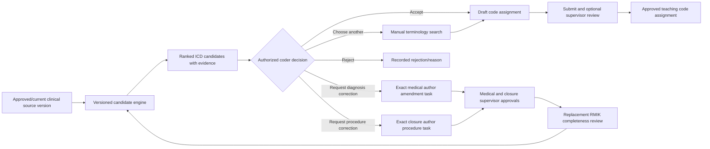

# Computer-Assisted Coding Specification

- **Version:** 1.3 reference specification
- **Status:** human-confirmed diagnosis/procedure coding and draft synthetic retrieval baseline implemented; expert validation pending
- **Owner of final scope and acceptance:** Daniel Happy Putra
- **Mode:** synthetic teaching data only
- **Primary UI term:** `Saran Koding Otomatis` with the persistent qualifier `Wajib ditinjau koder`

## 1. Outcome

Convert clinician-authored diagnosis and procedure statements into **ranked coding candidates** while preserving the professional separation between clinical documentation and RMIK coding. The feature should make learners faster and teach why a code was considered without pretending that text matching alone is authoritative coding.

## 2. Product boundary

### Current reference-increment boundary

- ICD-10 and ICD-9-CM workbook validation, immutable release activation, and manual search are implemented.
- Ranked ICD-10 candidates from an exact approved diagnosis source and ranked ICD-9-CM candidates from an exact approved performed-procedure source are implemented. Both use explicit coder decisions, immutable code-assignment drafts, linked RMIK-supervisor review, audit, and finalization gating.
- An immutable clinician-authored performed-procedure source is implemented at encounter closure. It requires an explicit `NONE_PERFORMED` or `PROCEDURES_RECORDED` attestation; each recorded item has completed status, authored text, performed time, performer, optional diagnosis/order linkage, and a content hash covered by closure supervision.
- Diagnosis and procedure use one typed coding spine with mutually exclusive sources: diagnosis requires ICD-10 and its medical-entry version; performed procedure requires ICD-9-CM and its exact closure-bound procedure record. Cross-system assignment is rejected.
- Diagnosis `CORRECTION_REQUESTED` opens an attributed medical-source amendment task, preserves operational orders, requires linked medical and closure supervision, forces a replacement RMIK review, and moves stale diagnosis assignments to `REVIEW_REQUIRED`. Closure replacement separately invalidates procedure assignments bound to the old closure source.
- Procedure `CORRECTION_REQUESTED` uses a separate attributed closure-amendment lifecycle. Only the exact closure/procedure author may create the successor; non-procedure closure fields and the original clinical occurrence time are locked; the linked medical supervisor and prior RMIK reviewer/supervisor must approve the successor chain before coding resumes.
- Controlled Indonesian synonym mappings and the synthetic gold-set threshold remain unapproved content; exact/normalized English catalog retrieval and honest no-candidate behavior are the current evaluated boundary.

The current evidence and limitations are recorded in the [Computer-Assisted Coding Validation Record](../operations/COMPUTER_ASSISTED_CODING_VALIDATION.md).

### Included

- ICD-10 2010 diagnosis candidate search and suggestion;
- ICD-9-CM 2010 procedure candidate search and suggestion;
- exact and normalized term matching, ranked retrieval, and versioned curated synonym/rule mappings;
- an engine boundary that can later host an evaluated NLP/model component;
- evidence display, confidence band, accept/edit/reject decisions, source linkage, and audit;
- supervisor review according to the configured teaching policy; and
- synthetic gold-case evaluation and debrief analytics.

### Excluded

- generating a clinical diagnosis from symptoms, observations, or measurements;
- changing the clinician-authored source statement;
- automatic primary/secondary diagnosis selection;
- silent code finalization or bulk acceptance;
- autonomous claim readiness, INA-CBG/IDRG grouping, tariff calculation, or production submission;
- using patient demographics to infer undocumented specificity; and
- representing a suggestion score as clinical or coding certainty.

## 3. Required source

The engine runs only when all of the following exist:

- a synthetic patient and active outpatient encounter;
- an exact clinician-authored diagnosis or procedure record;
- an immutable approved/current source version allowed by the scenario policy;
- an active terminology release for the correct classification type; and
- an authorized assignment with coding capability and exact case scope.

No source statement means no coding suggestion. A coding endpoint cannot create or edit the diagnosis/procedure it codes.

For procedure coding, an order is not a performed procedure. The source must be a `COMPLETED` procedure recorded in the exact current closure version and covered by its linked medical-supervisor approval and the current RMIK completeness review. The clinician records the performed statement, time, performer, optional body site/outcome/note, and optional reason/order links—but does not enter the ICD-9-CM assignment.

## 4. Candidate-generation contract

### 4.1 Initial reference engine

The first engine is deterministic and explainable:

1. normalize case, punctuation, whitespace, and safe abbreviation aliases without changing the stored source;
2. run exact code/display and token-aware terminology search;
3. apply only versioned, attributable synonym or scenario mappings;
4. rank candidates using recorded features;
5. return a bounded top list plus an explicit `no reliable candidate` outcome; and
6. persist the engine/version, terminology release, inputs, candidates, and explanation snapshot.

### 4.2 Future evaluated model adapter

A later NLP/model engine may be plugged into the same contract only after it has:

- a named model/version and immutable configuration;
- synthetic evaluation data separated from training or prompt examples;
- documented top-k retrieval performance and failure categories;
- prompt/input/output privacy controls;
- deterministic fallback and timeout behavior;
- no production external transmission without separate approval; and
- a feature flag and rollback path.

Model output remains a candidate, never an assignment.

## 5. Candidate presentation

Each candidate displays:

| Field | Purpose |
|---|---|
| Classification and version | Prevents an unlabeled or stale code system. |
| Code and authoritative display | Shows the candidate exactly as imported. |
| Rank | Orders candidates without implying approval. |
| Confidence band | `EXACT`, `STRONG_MATCH`, or `REVIEW_REQUIRED`; not a clinical probability. |
| Match evidence | Matched source phrase, terminology phrase, synonym/rule identifier, and engine version. |
| Specificity note | Indicates when the source lacks detail needed to choose safely. It never invents the missing detail. |
| Source version | Opens the exact diagnosis/procedure statement used to generate the candidate. |

The interface always provides source-matched `Cari kode lain` and `Tolak saran`. Diagnosis sources provide `Minta koreksi diagnosis`; procedure sources provide the separate `Minta koreksi prosedur` action. No source provides `Terima semua`.

## 6. Human decision and provenance

An authorized coder may:

- accept a candidate into a **draft** code assignment;
- choose a different code through manual search;
- reject one or all candidates with a reason; or
- request source correction when required diagnosis or performed-procedure detail is absent or contradictory.

For a performed-procedure source, the coder can accept, choose a manual ICD-9-CM alternative, reject with a reason, or request the dedicated procedure-source correction. The request cannot enter the diagnosis-authoring flow and cannot authorize the coder to edit clinical documentation.

The system records the candidate snapshot, decision, decision reason, coder assignment, time, resulting draft assignment, and any supervisor review. Manual selection is recorded as manual rather than falsely attributed to the engine.

If the medical source is amended, prior diagnosis suggestions and assignments remain historical and the assignments become `REVIEW_REQUIRED`. If the closure source is replaced, assignments bound to procedures in the old closure also become `REVIEW_REQUIRED`. Regeneration creates a new suggestion run against the exact successor source.

The implemented diagnosis-correction route is deliberately sequential:

1. the coder records a reason against the exact suggestion run, diagnosis statement, medical version/hash, and current approved RMIK review;
2. the encounter moves to `AMENDMENT_PENDING`, coding is blocked, and only the original medical-author assignment receives the correction task;
3. the author creates an immutable successor medical version with a change reason while the original clinical occurrence time, orders, and prescriptions remain locked;
4. the exact linked medical supervisor approves the successor, and every code assignment linked to an older medical version becomes `REVIEW_REQUIRED`;
5. the medical author creates a successor encounter closure and the exact linked supervisor approves its new source snapshot;
6. the encounter returns to RMIK, where the previous approval is treated as stale until the exact prior RMIK reviewer authors a successor completeness review and its linked supervisor approves it; and
7. only then is the correction resolved and coding re-enabled for a new suggestion run.

The procedure-correction route is separately sequential:

1. the coder records a reason against the exact procedure suggestion run, completed procedure/hash, source closure/hash, and current approved RMIK review;
2. coding is blocked and only the exact active closure/procedure-author assignment receives the procedure-correction task;
3. the author creates an immutable successor closure that changes performed-procedure documentation while all other authored closure fields and the original clinical occurrence time remain locked;
4. the exact linked medical supervisor approves the successor closure, which moves assignments bound to old procedure rows to `REVIEW_REQUIRED`;
5. the exact prior RMIK reviewer authors a replacement completeness review and the linked RMIK supervisor approves it; and
6. only then is the correction resolved and coding re-enabled against the successor procedure source.

## 7. Canonical data

### `terminology_release`

Stores classification system, logical version, source/provenance status, supplied filename, SHA-256, import actor/time, row counts, validation report, activation state/time, and replacement relationship.

### `terminology_concept`

Stores release, code, authoritative display, normalized search fields, hierarchy metadata where available, active flag, and optional controlled synonyms. The unique key is release plus code.

### `coding_suggestion_run`

Stores patient/encounter, explicit source type, exactly one diagnosis/medical-version pair or performed-procedure ID, the source-matched terminology release, engine type/version/configuration hash, normalized-input hash, generated time, outcome, and actor/assignment that requested it.

### `coding_suggestion_candidate`

Stores run, rank, concept, confidence band, score where used, evidence payload, and specificity warning. It is immutable and is not a code assignment.

### `coding_suggestion_decision`

Stores candidate/run, decision (`ACCEPTED_TO_DRAFT`, `REJECTED`, `MANUAL_ALTERNATIVE`, `CORRECTION_REQUESTED`), reason, coder assignment/time, and resulting code-assignment reference where applicable.

### `coding_documentation_correction`

Stores the correction decision, exact source condition/version and hashes, superseded RMIK review, requesting coder, responsible medical author, lifecycle status, medical response version, closure response, replacement RMIK review, and timestamps. Its provenance is immutable; only guarded lifecycle fields can advance.

### `procedure_documentation_correction`

Stores the source-typed correction decision, exact completed procedure and source closure, statement/procedure/closure hashes, superseded RMIK review, requesting coder, exact closure/procedure author, lifecycle status, successor closure, replacement RMIK review, and timestamps. Provenance is immutable; guarded transitions advance only through closure submission, linked medical-supervisor approval, and replacement RMIK approval.

## 8. Authorization and audit

- Viewing clinical source content requires exact patient/encounter/session scope.
- Generating or viewing candidates requires the coding task and terminology-search capability.
- Creating a code assignment requires `coding.write` and the current source version.
- Learners cannot approve their own work when the faculty-pilot policy requires supervision.
- Terminology import/activation is an administrator/reference-data capability, separate from coding.
- Generation, search, accept, reject, manual alternative, correction request, submit, return, approve, release activation, and import failure are audited.

## 9. Failure behavior

| Failure | Required behavior |
|---|---|
| No reliable candidate | Show an honest empty state and manual search; do not force a low-quality suggestion. |
| Source amended during work | Reject stale submit and require refresh/regeneration. |
| Wrong source/classification pair | Reject ICD-10 for a procedure and ICD-9-CM for a diagnosis before any assignment is created. |
| Procedure correction requested through diagnosis route | Reject with an explicit workflow message; preserve the procedure and create no false diagnosis-amendment task. |
| Terminology release unavailable | Preserve coding task and source; block suggestion/search with an actionable administrator message. |
| Engine timeout/error | Record safe diagnostic metadata, show manual search, and create no partial candidate run. |
| Duplicate/invalid workbook rows | Reject the staged import atomically; active release is unchanged. |
| Unauthorized direct request | Return a server-side denial and audit the denied action without exposing candidate/source content. |

## 10. Evaluation gates

Before Checkpoint 2 UAT, the reference engine must demonstrate on a versioned synthetic gold set:

- 100% prevention of automatic final assignment;
- 100% source-version and terminology-version provenance;
- exact-match and no-match behavior;
- top-1 and top-5 retrieval results reported separately for diagnoses and procedures;
- stale-source invalidation;
- robust handling of abbreviations, spelling variation, ambiguous terms, and insufficient specificity;
- no suggestion when the source is absent; and
- authorization, accessibility, transaction, and audit coverage.

No minimum accuracy number is silently invented. Daniel approves the pilot threshold after RMIK review of the reference results.

The executable draft baseline is `resources/coding/gold-sets/outpatient-reference-v1.json`. It binds both supplied release hashes, keeps catalog-derived reference assertions separate from unapproved Indonesian/stress proposals, and reports diagnosis/procedure top-1 and top-5 independently. The current evidence and gaps are recorded in the [Synthetic Coding Retrieval Baseline](../operations/CODING_GOLD_SET_BASELINE.md). Passing reference retrieval is not clinical validation; proposed mappings remain inactive until the checkpoint owners approve them.

## 11. Incremental implementation

1. **Reference-data registry and importer** — validate the supplied workbook contract, preserve checksums, and activate immutable releases.
2. **Terminology search** — accessible, bounded, version-labelled manual lookup with authorization and audit.
3. **Deterministic candidate engine** — explainable ranked suggestions and honest no-candidate behavior.
4. **RMIK workbench integration** — source selection, suggestion decisions, code-assignment draft, correction route, and supervision.
5. **Evaluation and checkpoint evidence** — synthetic gold cases, automated tests, browser/accessibility review, and joint RMIK/medicine validation.

The workbook evidence and current official cross-check are maintained in the [Coding Reference Register](../research/CODING_REFERENCE_REGISTER.md).
