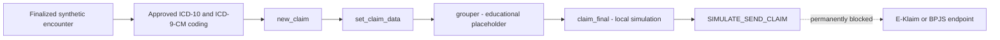
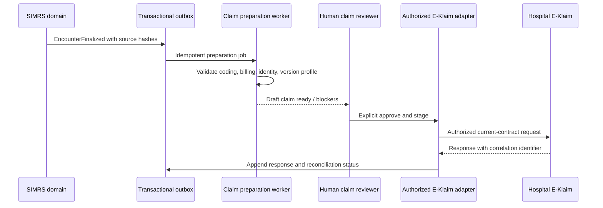

# E-Klaim and BPJS Claim Simulation Specification

> [!CAUTION]
> **HISTORICAL REFERENCE — NOT CURRENT CLEAN-SLATE RUNTIME EVIDENCE**
>
> This specification preserves an earlier never-sent E-Klaim teaching prototype. Current `HEAD` does **not** contain the E-Klaim/BPJS claim-simulation routes or runtime described below. Do not use this document to claim current implementation, acceptance, deployment, or production readiness. For current status, inspect the [current route surface](../../routes/web.php), [T1 local evidence boundary](../operations/T1_LOCAL_MILESTONE_APPROVAL_PACK_2026-08-26.md), [production-promotion readiness record](../operations/T1_PRODUCTION_PROMOTION_READINESS_2026-08-27.md), and [G0–G3 coverage ledger](../new-simrs-rebuild/G0_G3_COVERAGE_LEDGER_README.md).

## 1. Outcome

The earlier SIMRS Campus UEU reference increment was designed to demonstrate how a finalized outpatient encounter became a claim-preparation sequence without installing, copying, or transmitting through E-Klaim. That capability is not present in current `HEAD`.

This is an **educational compatibility simulator**, not:

- an E-Klaim replacement;
- a certified INA-CBG or IDRG grouper;
- proof of compatibility with every E-Klaim version;
- a BPJS claim submission client;
- a SATUSEHAT profile-conformant claim implementation; or
- authorization to process real patients or real claims.

## 2. Evidence from the supplied installation

The directory outside this repository was inspected read-only. Unknown binaries were not run.

| Evidence          | Observation                                                           | Design consequence                                                              |
| ----------------- | --------------------------------------------------------------------- | ------------------------------------------------------------------------------- |
| `EULA.TXT`        | Kemenkes ownership; unauthorized reproduction/distribution prohibited | Do not copy, decrypt, patch, or redistribute the application                    |
| `VERSION5.TXT`    | Major 5, minor 8, patch 8, build `202406270756`                       | Label the local evidence as 5.8.8, not as the current national release          |
| `ws.php`          | Local web-service entry point; ionCube-protected                      | Integrate through a service adapter, never protected internals                  |
| `api.php`         | Additional protected API entry point                                  | Do not infer undocumented contracts from encoded code                           |
| `UNUGrouper4.1/*` | Windows executable and DLL grouper components                         | Do not execute or redistribute in the campus app                                |
| `cache/session/*` | Captured session files exist                                          | Treat the supplied folder as sensitive; never import sessions into SIMRS Campus |
| File timestamps   | `ws.php` is newer than `VERSION5.TXT`                                 | Confirm the authorized runtime and manual together before compatibility claims  |

The package also documents an installer-default login. That credential is intentionally not copied into this repository. Any authorized hospital installation must replace defaults and follow its current operational guidance.

## 3. Current official context

The Ministry of Health's [SATUSEHAT BPJS claim interoperability page](https://satusehat.kemkes.go.id/platform/docs/id/interoperability/klaim-bpjs/) reports version 1.3 dated 20 August 2025 and says the module remains available only in the sandbox environment. Its described flow includes:

1. BPJS membership data;
2. facility encounter registration;
3. patient account data;
4. clinical data;
5. billing data;
6. invoice;
7. the facility submitting through E-Klaim;
8. E-Klaim sending a signed Claim/RME bundle;
9. BPJS purification and verification; and
10. facility follow-up through `ClaimResponse`, webhook, and purification decisions.

The page identifies `Coverage`, `Account`, `ChargeItem`, `Invoice`, `Claim`, and `ClaimResponse` alongside the clinical resources. It also states that E-Klaim uses the SATUSEHAT Encounter ID in the developing validation flow.

[Permenkes No. 26 of 2021](https://jdih.kemkes.go.id/documents/peraturan-menteri-kesehatan-nomor-26-tahun-2021) remains listed as in force and provides the INA-CBG claim-method framework for advanced referral facilities, BPJS Kesehatan, and related parties.

A public [Pusbiakes/Pusjak PDK Postman collection](https://www.postman.com/pusbikes/e-klaim/documentation/mqpss20/e-klaim-idrg) demonstrates the local `ws.php` JSON envelope and operations such as `new_claim` and `set_claim_data`. It is useful implementation evidence, but an institutional deployment must still obtain the current official manual matching its authorized E-Klaim installation.

## 4. Campus workflow



The final edge is not executable. Every response includes:

```json
{
    "boundary": {
        "classification": "SIMULASI — DATA SINTETIS",
        "transport_state": "NOT_SENT",
        "external_endpoint": null
    }
}
```

## 5. Source-to-payload mapping

| E-Klaim-compatible teaching field | SIMRS Campus source                | Rule                                                              |
| --------------------------------- | ---------------------------------- | ----------------------------------------------------------------- |
| `nomor_rm`                        | Synthetic MRN                      | Required; synthetic namespace only                                |
| `nomor_kartu`                     | Deterministic teaching identifier  | Generated locally; never a BPJS membership assertion              |
| `nomor_sep`                       | Encounter-derived teaching SEP     | Prefixed `SIM-SEP-`; never a real SEP                             |
| Patient name/date/sex             | Synthetic patient                  | Explicit sex required for the compatibility payload               |
| Admission/discharge               | Finalized encounter period         | Both timestamps required before claim simulation                  |
| Diagnosis                         | Approved human ICD-10 assignment   | At least one required; exact assignment and content hash retained |
| Procedure                         | Approved human ICD-9-CM assignment | At least one required in the current reference scenario           |
| `tarif_rs`                        | Teaching billing components        | Fixed synthetic component values; not financial truth             |
| Coder NIK                         | `0000000000000000`                 | Deliberate non-identity placeholder; cannot be transmitted        |
| Group/tariff result               | Local deterministic simulator      | Code `SIM-RJ-001`; not an INA-CBG/IDRG result                     |

## 6. State and control model

| State                  | Permitted next action | Stored evidence                                    |
| ---------------------- | --------------------- | -------------------------------------------------- |
| No case                | `CREATE_CLAIM`        | Immutable source snapshot and `new_claim` exchange |
| `CLAIM_CREATED`        | `STAGE_CLAIM_DATA`    | `set_claim_data` request/response                  |
| `DATA_STAGED`          | `GROUP_CLAIM`         | Placeholder grouper response                       |
| `GROUPED`              | `FINALIZE_CLAIM`      | Local finalization response                        |
| `FINALIZED`            | `SIMULATE_SUBMISSION` | Never-sent receipt                                 |
| `SUBMISSION_SIMULATED` | None                  | Completed local audit trail                        |

Controls:

- only finalized encounters in an active simulation session;
- synthetic patient flag and synthetic-only application configuration;
- approved diagnosis and procedure coding prerequisites;
- exact patient/encounter-scoped RMIK assignment;
- `claim.manage` capability for transitions;
- `claim.review` or report capability for read-only observation;
- unique request keys and transactional idempotency;
- immutable case source snapshot and append-only events;
- canonical JSON SHA-256 request and response hashes;
- private/no-store UI response headers; and
- no endpoint, key, token, queue, HTTP client, or retry worker in this increment.

## 7. Future authorized auto-sync design

“Auto-sync” should mean automated preparation and reconciliation, not automatic clinical coding or unattended final submission.



The future adapter must not be enabled until all of the following exist:

1. written institutional authority and an authorized E-Klaim environment;
2. the current Kemenkes web-service manual matching the installed runtime;
3. approved network placement and transport security;
4. secret storage and rotation for keys/credentials;
5. real identifier, SEP, coder, billing, and code-set governance;
6. versioned contract tests against an authorized sandbox/test instance;
7. retry, idempotency, timeout, dead-letter, and reconciliation behavior;
8. immutable audit, access review, retention, incident response, and backup controls;
9. RMIK/casemix and BPJS-facing workflow acceptance; and
10. a separate deployment approval and production-readiness record.

## 8. Explicitly prohibited shortcuts

- decrypting ionCube-protected source;
- decompiling or redistributing the supplied grouper;
- writing directly to the E-Klaim database;
- importing cached sessions, configuration, keys, or hospital data;
- treating a successful local response as an accepted BPJS claim;
- presenting `SIM-RJ-001` or Rp275,000 as a clinically or financially valid group/tariff;
- enabling a URL through environment configuration without the separate live-adapter design; or
- automatically finalizing or submitting a claim without human review.
