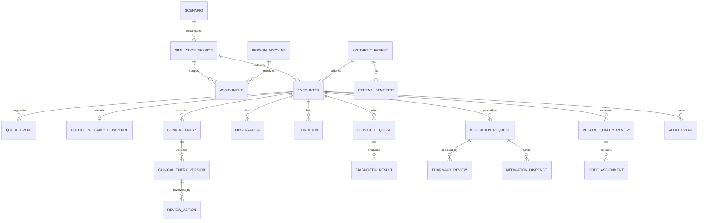

# Outpatient Data Dictionary

- **Version:** 1.3 reference baseline
- **Scope:** Minimum canonical data for the outpatient teaching-reference MVP
- **Data mode:** generated synthetic data only
- **Modeling rule:** purposeful relational domain model with versioned FHIR-aligned mappings at the integration boundary

## 1. Conventions

| Convention      | Rule                                                                                                                                                                            |
| --------------- | ------------------------------------------------------------------------------------------------------------------------------------------------------------------------------- |
| Primary keys    | Internal opaque UUID/ULID; external identifiers are never database primary keys.                                                                                                |
| Time            | Store timezone-aware instants in UTC; display in `Asia/Jakarta` unless the session specifies otherwise. Preserve clinical occurrence time separately from system-recorded time. |
| Codes           | Store `system`, `code`, `display`, and where available `version`; do not treat a translated UI label as the code.                                                               |
| Clinical values | Store value, type, unit code/system, interpretation if authored/configured, method, author, occurrence time, and status.                                                        |
| Authorship      | Record authenticated actor, acting role/capability, learner/supervisor relationship, and source document version.                                                               |
| Versions        | Submitted/approved clinical content is immutable. Corrections create a linked successor version and preserve the prior content.                                                 |
| Deletion        | Clinical, medication, review, and audit records are not hard-deleted through ordinary product workflows.                                                                        |
| Simulation      | Every patient, encounter, export, and external-message attempt carries an environment mode. MVP mode is `SIMULATION`.                                                           |
| Clinical rules  | No universal diagnostic/treatment threshold is embedded without a validated, versioned ruleset.                                                                                 |

## 2. Core relationship model

This diagram is conceptual. Migration design may split structured sections further while preserving these ownership boundaries.

## 3. Shared identity and teaching context

### 3.1 `scenario`

| Field                | Type              |    Required | Definition                                                                                                                                                            |
| -------------------- | ----------------- | ----------: | --------------------------------------------------------------------------------------------------------------------------------------------------------------------- |
| `id`                 | opaque ID         |         yes | Internal scenario identifier.                                                                                                                                         |
| `code`               | string            |         yes | Stable human-manageable scenario code.                                                                                                                                |
| `title`              | string            |         yes | Scenario title shown to instructors.                                                                                                                                  |
| `version`            | integer           |         yes | Immutable published scenario version.                                                                                                                                 |
| `learning_outcomes`  | structured list   |         yes | Intended competencies/outcomes.                                                                                                                                       |
| `rubric_references`  | structured list   |    optional | Scenario-versioned reference code, title, version, validation status, source label, and linked learning-outcome numbers. Contains no score, grade, or pass threshold. |
| `case_fixture_spec`  | structured object |         yes | Generator inputs, not real patient data.                                                                                                                              |
| `ruleset_version_id` | ID                |         yes | Configured required fields, supervision, and safety-screen questions.                                                                                                 |
| `status`             | enum              |         yes | `DRAFT`, `PUBLISHED`, `RETIRED`.                                                                                                                                      |
| `published_at`       | instant           | conditional | Time version became available for new sessions.                                                                                                                       |

### 3.2 `simulation_session`

| Field                              | Type       |     Required | Definition                                                 |
| ---------------------------------- | ---------- | -----------: | ---------------------------------------------------------- |
| `id`                               | opaque ID  |          yes | Isolated run of one scenario version.                      |
| `scenario_id` / `scenario_version` | ID/integer |          yes | Exact template instantiated.                               |
| `course_id`, `cohort_id`           | ID         |          yes | Teaching context.                                          |
| `environment_mode`                 | enum       |          yes | `SIMULATION`; future `SANDBOX` is separately configured.   |
| `status`                           | enum       |          yes | `SCHEDULED`, `ACTIVE`, `PAUSED`, `COMPLETED`, `CANCELLED`. |
| `starts_at`, `ends_at`             | instant    | yes/optional | Authorized learner-work window.                            |
| `facilitator_id`                   | account ID |          yes | Responsible facilitator.                                   |
| `source_session_id`                | ID         |     optional | Immediate pristine source when transactionally cloned for an isolated synthetic rerun; never evidence that progressed clinical state was copied. |

ADR-003 implements one shared encounter per isolated scenario run while VAL-T07 remains open. Another case uses a cloned/new session so clinical assignments remain exact. ADR-011 permits a clone only from the published pristine `OPD-REF-001` v1 graph in an opted-in synthetic non-production environment. It generates new session/patient/identifier/appointment/encounter/task/stock identities, remaps every assignment and supervisor link, records the immediate source, and copies no progressed state. A session may retain additional synthetic identity candidates for duplicate-resolution teaching, but they do not create additional encounters in the reference MVP.

### 3.3 `assignment`

| Field                                | Type       |    Required | Definition                                                           |
| ------------------------------------ | ---------- | ----------: | -------------------------------------------------------------------- |
| `id`                                 | opaque ID  |         yes | Contextual grant, not a global role.                                 |
| `session_id`                         | ID         |         yes | Assigned simulation session.                                         |
| `account_id`                         | ID         |         yes | Learner/supervisor/facilitator account.                              |
| `program`                            | coded enum |         yes | Medicine, nursing, RMIK, pharmacy, etc.                              |
| `application_role`                   | coded enum |         yes | Learner, supervisor, facilitator, registrar, coder, pharmacist, etc. |
| `task_capabilities`                  | list       |         yes | Explicit enabled actions.                                            |
| `patient_id`, `encounter_id`         | ID         | conditional | Scope narrowed to case/encounter when applicable.                    |
| `supervisor_assignment_id`           | ID         | conditional | Learner-to-supervisor relationship.                                  |
| `active_from`, `active_until`        | instant    |         yes | Time boundary.                                                       |
| `revoked_at`, `revoked_by`, `reason` | values     |    optional | Revocation provenance.                                               |

### 3.4 `synthetic_patient`

| Field                                                   | Type                 |            Required | Definition                                                                                                  |
| ------------------------------------------------------- | -------------------- | ------------------: | ----------------------------------------------------------------------------------------------------------- |
| `id`                                                    | opaque ID            |                 yes | Internal patient identity.                                                                                  |
| `synthetic_flag`                                        | boolean              |                 yes | Must be `true` in the MVP; database guard and import validation enforce it.                                 |
| `fixture_source`                                        | string/version       |                 yes | Generator/scenario provenance.                                                                              |
| `full_name`                                             | string               |                 yes | Clearly fictional name.                                                                                     |
| `birth_date`                                            | date                 |                 yes | Synthetic date used for age calculation.                                                                    |
| `administrative_sex`                                    | coded value          |                 yes | Stored separately from display translation.                                                                 |
| `address`                                               | structured object    |            optional | Fictional address with no real household data.                                                              |
| `phone`, `email`                                        | string               |            optional | Reserved synthetic ranges/domains only.                                                                     |
| `religion`, `occupation`, `education`, `marital_status` | coded/display values | optional/configured | Social registration data referenced by Permenkes 24/2022; scenario controls what is pedagogically required. |
| `deceased_flag`                                         | boolean              |                 yes | Defaults false for initial scenario.                                                                        |
| `record_status`                                         | enum                 |                 yes | `ACTIVE`, `POTENTIAL_DUPLICATE`, `MERGED_REFERENCE`, `ARCHIVED`.                                            |

### 3.5 `patient_identifier`

| Field                       | Type       | Required | Definition                                                      |
| --------------------------- | ---------- | -------: | --------------------------------------------------------------- |
| `id`                        | opaque ID  |      yes | Identifier record.                                              |
| `patient_id`                | ID         |      yes | Owning synthetic patient.                                       |
| `type`                      | enum       |      yes | `MRN`, `SYNTHETIC_NIK`, `SCENARIO_ID`, future external test ID. |
| `system`                    | URI/string |      yes | Issuing namespace.                                              |
| `value`                     | string     |      yes | Unique within issuing namespace.                                |
| `synthetic_flag`            | boolean    |      yes | Must be true in MVP.                                            |
| `valid_from`, `valid_until` | date/time  | optional | Identifier validity.                                            |
| `status`                    | enum       |      yes | `ACTIVE`, `REPLACED`, `ENTERED_IN_ERROR`.                       |

Synthetic NIK-like values are intentionally invalid for government/production use. They exist only to teach identifier handling.

## 4. Registration and encounter

### 4.1 `appointment_registration`

Minimum fields:

- patient and scenario/session identifiers;
- clinic/service/location;
- scheduled start and visit reason;
- visit source: scheduled, configured walk-in, referral simulation;
- coverage/guarantor simulation status with no real BPJS transaction;
- registration author and time;
- identity-verification method used in the exercise;
- consent/teaching acknowledgement version and time;
- status: `BOOKED`, `CHECKED_IN`, `CANCELLED`, `NO_SHOW`, `DEPARTED_ON_REQUEST`;
- duplicate-search decision and reason when a candidate was presented.

### 4.2 `encounter`

| Field                                                          | Type        |    Required | Definition                                                   |
| -------------------------------------------------------------- | ----------- | ----------: | ------------------------------------------------------------ |
| `id`                                                           | opaque ID   |         yes | Shared visit identifier across all modules.                  |
| `patient_id`, `session_id`                                     | ID          |         yes | Patient and teaching context.                                |
| `appointment_id`                                               | ID          |    optional | Source appointment.                                          |
| `encounter_number`                                             | string      |         yes | Human-visible synthetic visit number.                        |
| `class`                                                        | coded enum  |         yes | `AMBULATORY` for this slice.                                 |
| `service_type`                                                 | coded value |         yes | Outpatient service/clinic.                                   |
| `location_id`                                                  | ID          |         yes | Current/primary location. Location history is separate.      |
| `status`                                                       | enum        |         yes | State model from the service blueprint, including terminal `DEPARTED_ON_REQUEST` after an attended early departure. |
| `period_start`, `period_end`                                   | instant     | conditional | Actual visit period.                                         |
| `care_team`                                                    | relations   |         yes | Assigned learners/supervisors and configured teaching roles. |
| `disposition`                                                  | coded value | conditional | Scenario-configured leaving/transfer/follow-up disposition.  |
| `closure_requested_at`, `clinically_closed_at`, `finalized_at` | instant     | conditional | Lifecycle evidence.                                          |
| `environment_mode`                                             | enum        |         yes | `SIMULATION`.                                                |

### 4.3 `queue_event`

Store queue ticket, clinic, state (`WAITING`, `CALLED`, `IN_SERVICE`, `HELD`, `COMPLETED`, `CANCELLED`), actor, reason, and start/end time. Public displays use ticket/limited identity only and never expose a diagnosis.

### 4.4 `outpatient_safety_disposition`

Store one append-only human workflow decision for an escalated synthetic encounter:

| Field                                      | Type        | Required | Definition                                                                                 |
| ------------------------------------------ | ----------- | -------: | ------------------------------------------------------------------------------------------ |
| `public_id`, `request_key`                  | opaque ULID |      yes | Public evidence identity and idempotency key.                                               |
| `encounter_id`                              | ID          |      yes | Unique encounter; only one disposition is allowed in the current reference cycle.          |
| `source_clinical_entry_version_id`          | ID          |      yes | Exact approved nursing-intake version that produced the escalation.                         |
| `source_content_hash`                       | SHA-256     |      yes | Immutable source-binding check.                                                             |
| `actor_user_id`, `actor_assignment_id`      | ID          |      yes | Attributable authorized human and acting context.                                           |
| `outcome`                                   | enum        |      yes | `RESUME_ROUTINE_FLOW` or `SIMULATED_TRANSFER`; neither is a clinical recommendation.        |
| `rationale`                                 | text        |      yes | Human-authored protected reason, 10–2000 characters, excluded from task and audit metadata. |
| `occurred_at`                               | instant     |      yes | Server-recorded decision time.                                                              |

The record cannot be updated or deleted. The source, actor, outcome, rationale, and time remain separate from the encounter state transition and are shown read-only after recording.

### 4.5 `outpatient_early_departure`

Store one append-only human record when a checked-in synthetic patient requests to leave after clinical service begins but before routine clinical closure:

| Field                                 | Type                  | Required | Definition                                                                                                      |
| ------------------------------------- | --------------------- | -------: | --------------------------------------------------------------------------------------------------------------- |
| `public_id`, `request_key`             | opaque ULID           |      yes | Public evidence identity and idempotency key.                                                                  |
| `session_id`, `patient_id`, `encounter_id` | ID               |      yes | Exact simulation and case context; encounter is unique in this table.                                          |
| `actor_user_id`, `actor_assignment_id` | ID                   |      yes | Exact medical supervisor or session facilitator and acting context.                                            |
| `outcome`                              | enum                  |      yes | `PATIENT_REQUESTED_DEPARTURE`; interoperability mapping is `aadvice`, with no transmission claim.              |
| `source_encounter_status`              | encounter-state enum  |      yes | Eligible pre-departure clinical state captured before transition.                                              |
| `source_snapshot`                      | minimized JSON        |      yes | Current nursing/medical public IDs, version numbers, statuses, and hashes; clinical text is not copied.         |
| `source_snapshot_hash`                 | SHA-256               |      yes | Canonical integrity hash of the exact minimized snapshot.                                                      |
| `stated_reason`                        | protected text        |      yes | Patient/representative-stated reason, 10–1000 characters, excluded from generalized audit/timeline metadata.   |
| `communication_summary`                | protected text        |      yes | Factual human-authored summary, 10–2000 characters, with no system-generated clinical verdict.                 |
| `occurred_at`                          | instant               |      yes | Server-recorded event time.                                                                                    |

Recording is transactional: encounter and appointment become terminal `DEPARTED_ON_REQUEST`, active queue work completes, and unfinished tasks are cancelled while completed history remains. This state is deliberately not `CANCELLED`, `NO_SHOW`, routine clinical closure, transfer, or `FINALIZED`; it creates no RMIK approval, coding assignment, report, debrief release, or transmission.

## 5. Clinical documentation and provenance

### 5.1 `clinical_entry`

The stable logical document identity:

- patient, encounter, authoring discipline, document type;
- owning author assignment;
- current version pointer;
- sensitivity class;
- lifecycle status;
- replacement/amendment relationship where applicable.

Document types in the slice include nursing intake, medical assessment, outpatient plan/summary, pharmacy note, and RMIK correction response.

### 5.2 `clinical_entry_version`

| Field                                       | Type                        |    Required | Definition                                                                            |
| ------------------------------------------- | --------------------------- | ----------: | ------------------------------------------------------------------------------------- |
| `id`, `clinical_entry_id`                   | ID                          |         yes | Immutable version identity and parent.                                                |
| `version_number`                            | integer                     |         yes | Monotonically increasing per entry.                                                   |
| `content`                                   | validated structured object |         yes | Schema-versioned clinical sections; not arbitrary unvalidated JSON.                   |
| `schema_version`                            | string                      |         yes | Form/content contract version.                                                        |
| `author_account_id`, `author_assignment_id` | ID                          |         yes | Person and acting context.                                                            |
| `clinical_occurrence_at`                    | instant                     |         yes | When the assessment/service occurred.                                                 |
| `recorded_at`                               | instant                     |         yes | Server time when persisted.                                                           |
| `status`                                    | enum                        |         yes | `DRAFT`, `SUBMITTED`, `CHANGES_REQUESTED`, `APPROVED`, `AMENDED`, `ENTERED_IN_ERROR`. |
| `change_reason`                             | coded/text value            | conditional | Required for a new version after submission.                                          |
| `supersedes_version_id`                     | ID                          |    optional | Prior version preserved.                                                              |
| `content_hash`                              | string                      |         yes | Integrity aid for exact reviewed content.                                             |

### 5.3 `review_action`

Store reviewed version ID/hash, reviewer account/assignment, action (`SUBMIT`, `REQUEST_CHANGES`, `APPROVE_SIMULATION`, `REJECT`, `ACKNOWLEDGE`, `REQUEST_AMENDMENT`), structured findings/comment, and server timestamp. Approval applies only to that exact version.

## 6. Nursing intake and safety screen

### 6.1 Minimum authored fields

- source/reliability of history when configured;
- chief complaint and onset/duration as authored narrative/structured fields;
- consciousness/mental status observation;
- allergy status: known allergy, no known allergy reported, or not yet assessed;
- current medication statement, including explicitly none/unknown;
- vital observations: temperature, heart rate, respiratory rate, systolic/diastolic blood pressure, and oxygen saturation when configured;
- anthropometry when configured: weight, height, BMI derived with visible provenance;
- configurable safety-screen question responses;
- learner-selected decision: `ROUTINE_FLOW`, `REVIEW_REQUIRED`, or `ESCALATE_TO_SUPERVISOR`;
- free-text note and handoff summary;
- author, clinical time, recorded time, and review status.

### 6.2 `observation`

| Field                                             | Type        |    Required | Definition                                                                  |
| ------------------------------------------------- | ----------- | ----------: | --------------------------------------------------------------------------- |
| `id`, `patient_id`, `encounter_id`                | ID          |         yes | Identity and context.                                                       |
| `category`                                        | coded value |         yes | Vital signs, exam, survey, etc.                                             |
| `code_system`, `code`, `display`, `version`       | values      |         yes | Standard concept; LOINC where required by an implemented SATUSEHAT mapping. |
| `value_type`                                      | enum        |         yes | Quantity, coded, boolean, string, integer, range.                           |
| `value`                                           | typed value |         yes | Original recorded value.                                                    |
| `unit_system`, `unit_code`, `unit_display`        | values      | conditional | UCUM where applicable.                                                      |
| `occurrence_at`, `recorded_at`                    | instant     |         yes | Clinical and system time.                                                   |
| `status`                                          | enum        |         yes | `PRELIMINARY`, `FINAL`, `AMENDED`, `ENTERED_IN_ERROR`.                      |
| `author_assignment_id`, `source_entry_version_id` | ID          |         yes | Provenance.                                                                 |
| `data_quality_flag`                               | list        |    optional | Missing/out-of-configured-range/confirmed; not a diagnosis.                 |

The application may validate type, unit, impossible format, and scenario-configured ranges. It must not convert a warning into a clinical diagnosis or treatment recommendation.

### 6.3 `allergy_intolerance`

Store clinical status, verification status, category, substance code/text, reaction description, severity if authored, onset, recorder, source, and last reviewed time. `No known allergy reported` is a documented assessment state, not the absence of a row.

## 7. Medical assessment, diagnosis, order, and result

### 7.1 Medical assessment minimum

- chief complaint confirmation;
- history of present illness;
- relevant history, medication, allergy, family/social fields as scenario requires;
- physical examination findings;
- assessment/problem list;
- diagnosis with certainty/role (working, differential, final for scenario) where configured;
- plan, service requests, procedures, prescription, education;
- follow-up and intended disposition;
- author/supervision/version provenance.

### 7.2 `condition`

Store authored clinical text, clinical/verification status, category, primary/secondary role, onset, author, source entry version, and optional coded concepts. For coding review, keep clinician-authored diagnosis separate from RMIK code assignment. A code never replaces the source statement.

### 7.3 `service_request`

Store request type, requested service/test, reason/source condition, authored clinical question, requester, occurrence/authored time, priority as scenario data, status (`DRAFT`, `ACTIVE`, `ON_HOLD`, `COMPLETED`, `CANCELLED`), supervision state, and fulfillment link.

### 7.4 `diagnostic_result`

Store source request, report code, status (`PRELIMINARY`, `FINAL`, `CORRECTED`, `CANCELLED`), issued/effective times, observations/components, narrative conclusion, performer/facilitator source, version/supersession, and acknowledgement. All results are visibly synthetic.

## 8. Medication and pharmacy

### 8.1 `medication_request`

Store patient/encounter, authored medication concept, form, strength, dose, route, frequency/timing, duration/quantity, directions, indication/source condition when configured, requester, authored time, status, supervision state, and replacement/cancellation reason.

### 8.2 `pharmacy_review`

| Field group    | Minimum contents                                                                                                                            |
| -------------- | ------------------------------------------------------------------------------------------------------------------------------------------- |
| Administrative | Patient, requester, date, clinic/unit completeness outcomes.                                                                                |
| Pharmaceutical | Medicine/form/strength, directions, preparation/stability considerations as scenario data, outcome and comment.                             |
| Clinical       | Indication/dose/timing, duplication, allergy/adverse-reaction, contraindication, interaction review outcomes as learner-authored judgments. |
| Overall        | `ACCEPT`, `CLARIFICATION_REQUIRED`, `RECOMMEND_CANCEL`, reviewer, time, supervisor state.                                                   |

The application shows source facts and missing-data warnings. It does not claim to have clinically cleared the prescription automatically.

### 8.3 `pharmacy_intervention`

Store affected request/item, issue category, question/recommendation, urgency as scenario data, opened by/time, prescriber response, resolution, status, and all message authors. It is not a free-form chat that can be deleted.

### 8.4 `medication_dispense`

Store request/item, quantity and unit, substitution flag/reason if scenario permits, preparation status, final-check actor/time, synthetic lot/expiry where configured, handoff recipient/time, counseling topics/acknowledgement, outcome (`COMPLETE`, `PARTIAL`, `NOT_DISPENSED`, `CANCELLED`), and reason. Stock movement is transactional and marked simulated.

## 9. Closure, RMIK review, and coding

### 9.1 Encounter closure minimum

- final/working diagnoses for the simulation;
- procedures/services performed;
- result acknowledgement status;
- medication outcome;
- leaving condition and disposition;
- follow-up plan and referral simulation where relevant;
- education/instructions;
- concise outpatient summary;
- author and supervisor attestation;
- blocking-task check outcome.

### 9.2 `record_quality_review`

Store encounter, checklist/ruleset version, reviewer assignment, review start/end, each finding, severity (`BLOCKING`, `NON_BLOCKING`, `INFORMATIONAL`), affected document/version, requested action, responsible author, resolution evidence, overall result, and supervisor approval.

### 9.3 `terminology_release`

Store classification type/system, logical version, source/provenance status, supplied filename, SHA-256, import actor/time, populated and ignored-blank row counts, validation report, release status (`IMPORTED`, `ACTIVE`, `SUPERSEDED`), activation actor/time, and optional replaced-release reference. Invalid workbooks are rejected before a release is persisted. An activated release is immutable.

### 9.4 `terminology_concept`

Store terminology release, code, authoritative display, normalized search representation, active flag, hierarchy/parent metadata where the source supports it, and controlled synonym records with their own provenance. Enforce one concept per release/code. A UI translation never overwrites the authoritative display.

### 9.5 `coding_suggestion_run` and `coding_suggestion_candidate`

The run stores encounter, explicit `source_type`, mutually exclusive `source_condition_id` plus `source_entry_version_id` or `source_procedure_id`, the matching terminology release, requesting coder assignment, engine type/version/configuration hash, normalized-input hash, generated time, completion outcome, and error category where applicable. `DIAGNOSIS` requires ICD-10; `PROCEDURE` requires ICD-9-CM. Each immutable candidate stores rank, terminology concept, confidence band, optional retrieval score, match evidence, specificity warning, and decision relationship. A candidate is not a code assignment.

### 9.6 `coding_suggestion_decision`

Store run/candidate, decision (`ACCEPTED_TO_DRAFT`, `REJECTED`, `MANUAL_ALTERNATIVE`, `CORRECTION_REQUESTED`), reason, coder assignment/time, and resulting code-assignment or correction-request reference. Manual selection is explicitly recorded as manual. `CORRECTION_REQUESTED` follows a source-typed lifecycle: diagnosis enters `coding_documentation_correction`; procedure enters `procedure_documentation_correction`. Neither route grants the coder clinical editing rights.

### 9.7 `coding_documentation_correction`

Store the exact `CORRECTION_REQUESTED` decision, source condition and medical entry version, source statement/content hashes, current approved RMIK review that is being superseded, requesting coder assignment, responsible medical-author assignment, reason, and request time. Guarded lifecycle fields link the submitted/approved medical successor, submitted/approved closure successor, replacement approved RMIK review, and resolution time. The row is append-only outside those lifecycle transitions.

The amendment route preserves the original clinical occurrence time and forbids order or prescription changes. The old medical version, closure, RMIK approval, suggestion runs, decisions, and code assignments remain historical. Coding is unavailable until the successor closure and RMIK review are current.

### 9.8 `procedure_documentation_correction`

Store the exact procedure `CORRECTION_REQUESTED` decision, completed source procedure, source closure, source statement/procedure/closure hashes, superseded approved RMIK review, requesting coder, exact responsible closure/procedure author, reason, and request time. Guarded lifecycle fields link the submitted and approved successor closure, replacement approved RMIK review, and resolution time.

Only performed-procedure documentation may change in the successor closure. Other authored closure fields and the original clinical occurrence time are locked. The row and all provenance fields are append-only; lifecycle changes occur only through the attributed author, linked medical supervisor, prior RMIK reviewer, and linked RMIK supervisor workflow.

### 9.9 `clinical_procedure`

| Field                                                       | Type       |     Required | Definition                                                                                                 |
| ----------------------------------------------------------- | ---------- | -----------: | ---------------------------------------------------------------------------------------------------------- |
| `id`, `public_id`                                           | IDs        |          yes | Internal relation key and non-sequential UI/integration identifier.                                        |
| `encounter_closure_id`                                      | ID         |          yes | Exact immutable closure version containing the clinician statement.                                        |
| `session_id`, `patient_id`, `encounter_id`                  | IDs        |          yes | Exact synthetic case scope.                                                                                |
| `status`                                                    | enum       |          yes | `COMPLETED` in the current performed-procedure increment; planned/order state is not accepted here.        |
| `authored_text`                                             | text       |          yes | Clinician-authored description of what was actually performed; contains no RMIK code assignment.           |
| `performed_start_at`, `performed_end_at`                    | timestamps | yes/optional | Actual procedure time or period. End cannot precede start.                                                 |
| `performer_text`                                            | text       |          yes | Human-readable performer recorded by the clinician; future practitioner mapping remains separate.          |
| `reason_condition_id`, `based_on_service_request_id`        | IDs        |     optional | Exact approved diagnosis reason and/or originating order. Neither link proves that the procedure occurred. |
| `body_site_text`, `outcome_text`, `note`                    | text       |     optional | Authored procedure context without inventing terminology mappings.                                         |
| `recorder_user_id`, `recorder_assignment_id`, `recorded_at` | values     |          yes | Accountable author and server-recorded time.                                                               |
| `content_hash`                                              | SHA-256    |          yes | Canonical source hash copied into the supervised closure snapshot and future coding provenance.            |

The closure also carries an explicit `NONE_PERFORMED` or `PROCEDURES_RECORDED` attestation. Procedure rows and closure versions are append-only; a later correction creates a successor closure/source rather than overwriting history.

### 9.10 `code_assignment`

| Field                                            | Type        |    Required | Definition                                                                                                      |
| ------------------------------------------------ | ----------- | ----------: | --------------------------------------------------------------------------------------------------------------- |
| `id`, `review_id`                                | ID          |         yes | Assignment and quality-review context.                                                                          |
| `source_type`                                    | enum        |         yes | `DIAGNOSIS` or `PROCEDURE`; determines the only allowed classification system.                                  |
| `source_condition_id`, `source_entry_version_id` | IDs         | conditional | Both required for `DIAGNOSIS`; both null for `PROCEDURE`.                                                       |
| `source_procedure_id`                            | ID          | conditional | Required for `PROCEDURE`; null for `DIAGNOSIS`. It points to the completed record in the exact current closure. |
| `classification_system`                          | URI/string  |         yes | ICD-10 for diagnosis or ICD-9-CM for performed procedure. Cross-system assignment is rejected.                  |
| `classification_version`                         | string/date |         yes | Version used in the exercise.                                                                                   |
| `code`, `display`                                | values      |         yes | Selected code and authoritative display.                                                                        |
| `role`                                           | enum        |         yes | Primary, secondary, external cause, procedure, etc., as configured.                                             |
| `suggestion_decision_id`                         | ID          |    optional | Exact accepted/manual decision provenance; null for a fully manual legacy-compatible draft.                     |
| `coder_assignment_id`, `coded_at`                | values      |         yes | Provenance.                                                                                                     |
| `status`                                         | enum        |         yes | `DRAFT`, `SUBMITTED`, `APPROVED`, `CHANGES_REQUESTED`, `REVIEW_REQUIRED`.                                       |
| `reviewer_assignment_id`, `reviewed_at`          | values      | conditional | Supervisor review.                                                                                              |

Changing or retiring a terminology release never rewrites an existing assignment. Amending the medical source moves linked diagnosis assignments to `REVIEW_REQUIRED`; replacing a closure does the same for assignments linked to its superseded procedure rows. Historical runs, decisions, assignments, and reviews remain intact.

### 9.11 `debrief_note` and `debrief_note_version`

The logical note stores public ID, encounter, immutable note type (`FACILITATOR_SYNTHESIS`, `GUIDED_REFLECTION`, or `FOLLOW_UP_ACTION`), creator assignment, create request key, and created time. It is shared teaching evidence visible through the same `debrief.view` case/session boundary as the finalized timeline; it is not a clinical entry, legal signature, private surveillance note, or grade.

Each append-only version stores public ID, note, monotonically increasing version number, author assignment, revision request key, plain-text body, SHA-256 content hash, authored time, and a required change reason from version 2 onward. The latest version is selected deterministically by version number. Versions cannot be updated or deleted through ordinary application code. New versions require `debrief.write`, an active simulation session, and a finalized matching encounter. Repeating the same request key returns the existing version.

## 10. Audit event

Every material action produces an append-only audit event containing:

- event ID and server time;
- authenticated actor and acting assignment/capability;
- session, patient, and encounter references where applicable;
- action, resource type/ID/version, and outcome;
- reason/purpose for sensitive or exceptional access;
- request correlation ID, originating IP/device metadata with appropriate minimization;
- before/after summary or changed-field metadata where appropriate, excluding secrets;
- authorization decision metadata for protected operations;
- export/integration destination classification when applicable.

Audit events are not a substitute for domain versions; both are required.

## 11. FHIR-aligned integration map

| Internal concept                 | Future SATUSEHAT/FHIR boundary                               | MVP behavior                                                                                          |
| -------------------------------- | ------------------------------------------------------------ | ----------------------------------------------------------------------------------------------------- |
| Synthetic patient/identifier     | `Patient`                                                    | Validate mapping locally; no production transmission.                                                 |
| Outpatient encounter             | `Encounter`                                                  | Persist internal state and future external identifier separately.                                     |
| Chief complaint/history sections | Playbook-specific resources/Composition sections             | Keep authored structured/narrative data and adapter mapping tests.                                    |
| Vital/physical findings          | `Observation`                                                | Store coded concepts and UCUM units where mapped.                                                     |
| Diagnosis/problem                | `Condition`                                                  | Keep clinician statement and code mappings distinct.                                                  |
| Order                            | `ServiceRequest`                                             | Maintain requester, reason, status, and idempotent mapping identity.                                  |
| Performed procedure              | `Procedure`                                                  | Persist completed clinician-authored source separately from its order and future ICD-9-CM assignment. |
| Result                           | `DiagnosticReport` and `Observation`                         | Preserve status/version and acknowledgement.                                                          |
| Prescription                     | `MedicationRequest` and `Medication`                         | Map only validated fields; never claim transmission from UI state alone.                              |
| Prescription review              | `QuestionnaireResponse` in current playbook where applicable | Version adapter contract independently from internal review model.                                    |
| Dispensing                       | `MedicationDispense`                                         | Map completed synthetic dispense in sandbox-only future work.                                         |
| Outpatient summary               | `Composition`                                                | Generate from approved source entries; no manually divergent duplicate.                               |

### 11.1 Finalized report projections

The reference MVP exposes two read-only projections rather than storing a new signed-document row:

- `OUTPATIENT_SUMMARY` derives its content from the current approved nursing and medical versions, current result and medication outcomes, approved closure/performed procedures, and approved human coding assignments;
- `DEBRIEF_EVIDENCE` derives its content from the curated material timeline, shared debrief-note version lineages, learning outcomes, and non-scoring rubric-reference metadata; and
- both carry encounter finalization time, on-demand generation time, permanent synthetic classification, no-store/no-index response policy, and a non-legal/non-FHIR statement.

`report.rendered` stores only report type, section count, and source counts. The report body, patient identity, diagnosis text, debrief-note text, terminology hash, IP address, and raw audit fields are not copied into event metadata. A future persisted PDF/document module must add immutable content hashing, authenticator/custodian/security-label policy, disclosure purpose/recipient, retention, and replacement lineage before it can be treated as a managed document.

Adapter records must retain contract version, request/response hash or safe metadata, correlation ID, status, retry count, external test identifier, and reconciliation outcome. Secrets and full tokens never enter application logs.

## 12. Synthetic-data guardrails

- fixture generators use reserved fictional names, addresses, contact domains, and identifier namespaces;
- imports default to denied; any future import requires an explicit synthetic-data validator and privileged purpose;
- UI, print, PDF, CSV, screenshots, and debrief exports display `SIMULASI — DATA SINTETIS`;
- production SATUSEHAT/BPJS endpoints and credentials cannot be configured in the MVP environment profile;
- seeders are deterministic enough for tests but can generate isolated session variants;
- test data never comes from copied real records, even if de-identified informally;
- logs, analytics, and backups are treated as sensitive despite the synthetic source;
- a session reset creates a new run or applies a documented lifecycle policy; it does not conceal prior learner activity.

## 13. Data-quality rules versus clinical rules

| Safe deterministic validation                                                                                        | Requires clinical/teaching validation                                             |
| -------------------------------------------------------------------------------------------------------------------- | --------------------------------------------------------------------------------- |
| Required field is absent.                                                                                            | Whether a field should be required for a learner level.                           |
| Value is not numeric/date/coded as required.                                                                         | Whether a numeric value is clinically dangerous.                                  |
| Unit is absent or not allowed for that observation definition.                                                       | What escalation or treatment follows a measurement.                               |
| End time precedes start time.                                                                                        | Whether timing is clinically acceptable.                                          |
| Prescription lacks an author, patient, date, clinic, or item.                                                        | Whether dose, indication, contraindication, or interaction is acceptable.         |
| Coding assignment has no exact source pair, uses both source types, or uses the wrong classification for its source. | Whether the selected diagnosis/procedure is clinically or professionally correct. |
| Approved content changed without a new version.                                                                      | Whether an amendment is clinically sufficient.                                    |

The left column can block invalid persistence. The right column is learner/supervisor-authored or a versioned, approved teaching ruleset.

## Related documents

- [Evidence Register](../research/OUTPATIENT_EVIDENCE_REGISTER.md)
- [Service Blueprint](OUTPATIENT_SERVICE_BLUEPRINT.md)
- [Role and Permission Matrix](OUTPATIENT_ROLE_MATRIX.md)
- [Assumption and Validation Register](ASSUMPTION_AND_VALIDATION_REGISTER.md)
