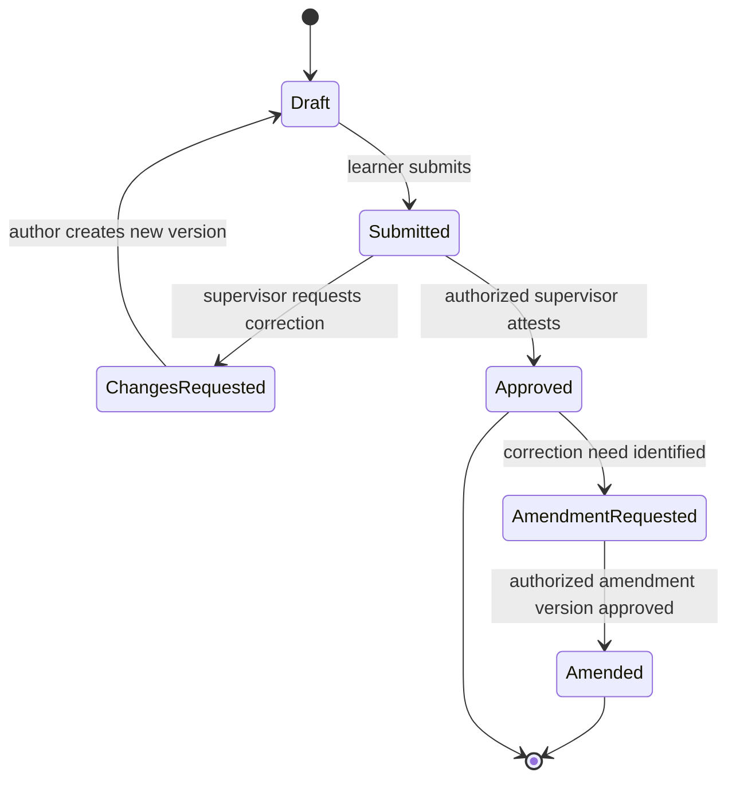

# Outpatient Service Blueprint

- **Version:** 1.0 reference baseline
- **Status:** Product-owner baseline; ready for staged validation
- **Scope:** One synthetic outpatient encounter across medicine, nursing, pharmacy, and RMIK
- **Primary interface language:** Indonesian
- **Mode:** `SIMULATION` only

## 1. Purpose

This blueprint gives the team a concrete model to inspect and correct. It is intentionally complete enough to build before every study program is interviewed. It is not a clinical protocol and does not define treatment rules.

The journey succeeds when one synthetic patient moves through one shared encounter, each learner performs only assigned work, supervisors can review attributable versions, pharmacy can review and dispense a prescription, RMIK can verify completeness and coding, and the full event history is available for debrief.

## 2. Reference scenario frame

The initial fixture will contain:

- one adult synthetic patient with an unmistakably fictional identity;
- one scheduled outpatient appointment;
- one ambulatory clinic and one pharmacy location;
- one learner assignment each for registration/RMIK, nursing, medicine, and pharmacy;
- one supervisor for each discipline, with a facilitator optionally acting across roles in development;
- a configurable complaint and clinical case that can exercise assessment, diagnosis, prescription, and follow-up without requiring emergency treatment;
- zero production integrations and zero real identifiers.

The actual complaint, findings, diagnosis, medicine, and scoring rubric remain configurable until Checkpoint 1 validation.

## 3. Patient journey

```mermaid
flowchart LR
    A["Scenario prepared"] --> B["Session started"]
    B --> C["Registration verified"]
    C --> D["Patient checked in"]
    D --> E["Nursing intake and safety screen"]
    E --> F{"Escalation required?"}
    F -- "Yes" --> X["Pause routine flow and notify supervisor"]
    X --> Y["Facilitator records disposition"]
    F -- "No" --> G["Medical assessment"]
    G --> H["Diagnosis, plan, orders, prescription"]
    H --> I{"Result ordered?"}
    I -- "Yes" --> J["Simulated result entered and acknowledged"]
    I -- "No" --> K["Pharmacy review"]
    J --> K
    K --> L{"Prescription acceptable?"}
    L -- "Clarification needed" --> M["Pharmacy intervention and prescriber response"]
    M --> K
    L -- "Accepted" --> N["Prepare, final check, dispense, counsel"]
    N --> O["Medical disposition and encounter closure"]
    O --> P["RMIK completeness and coding review"]
    P --> Q{"Correction required?"}
    Q -- "Yes" --> R["Author amendment and supervisor re-review"]
    R --> P
    Q -- "No" --> S["Record finalized for simulation"]
    S --> T["Supervisor debrief"]
```

`Escalation required` is a workflow decision recorded by the learner or supervisor. The software does not diagnose urgency or recommend treatment.

## 4. Frontstage and backstage blueprint

| Stage | Learner-facing action | System behavior | Record produced | Handoff/exit condition |
|---|---|---|---|---|
| 0. Scenario setup | Facilitator selects case, cohort, roles, supervisors, clinic, and session time. | Clone immutable scenario template into an isolated simulation session; generate synthetic patient and assignment scope. | Scenario version, session, assignments, fixture provenance. | Required roles assigned and session activated. |
| 1. Registration | Registration/RMIK learner searches before creating, confirms demographic/social data, coverage simulation, appointment, and consent acknowledgement. | Detect possible synthetic duplicates, issue MRN from simulation sequence, validate required fields, preserve identity changes. | Patient, identifiers, appointment, registration, consent acknowledgement. | Identity verified and appointment checked in. |
| 2. Queue/check-in | Registrar places patient in the clinic queue. | Create queue ticket and timestamps; expose only appropriate status on public queue display. | Queue event and encounter in `ARRIVED`. | Nursing role accepts the assigned patient. |
| 3. Nursing intake and safety screen | Nursing learner records chief complaint, allergies, current medicine statement, consciousness, vital signs, optional anthropometry, safety questions, and escalation decision. | Validate units/ranges for data quality only, flag missing required data, retain provenance, route draft for review according to scenario policy. | Intake assessment, observations, allergy/intolerance, medication statement, safety-screen decision. | `ROUTINE_FLOW` or supervisor-managed `ESCALATED`. |
| 4. Medical assessment | Medical learner reviews earlier entries and records history, examination, assessment, problem/diagnosis, plan, orders, prescription, education, and intended disposition. | Show source and draft status, prevent editing nursing entries, record clinical and entry times, submit for medical supervisor review. | Medical assessment version, diagnoses, procedures, service requests, medication request, plan. | Required draft sections complete and submitted/approved per session rules. |
| 5. Result loop | Assigned result operator/facilitator releases a synthetic result; medical learner acknowledges it and may amend the plan. | Link order to result, distinguish preliminary/final/corrected, record acknowledgement, notify relevant queue. | Result version, acknowledgement, optional plan amendment. | All blocking results acknowledged or explicitly deferred. |
| 6. Pharmacy review | Pharmacy learner reviews administrative, pharmaceutical, and clinical domains and records accept, clarification, or reject/cancel recommendation. | Derive source data, highlight missing fields, record each review result, open intervention thread without modifying the prescription. | Pharmacy review and intervention. | Accepted prescription, prescriber clarification, or documented cancellation. |
| 7. Dispensing | Pharmacy learner records availability, preparation, final check, quantity, simulated batch/expiry where configured, handoff, and counseling. | Enforce separation of review/check steps configured for the scenario; update simulated stock ledger transactionally. | Dispense event, stock movement, counseling acknowledgement. | All accepted items dispensed/partially dispensed/cancelled with reasons. |
| 8. Closure | Medical learner or supervisor confirms follow-up, leaving condition, disposition, patient education, and summary. | Check blocking tasks; create closure request; supervisor may approve or return for correction. | Disposition, follow-up, outpatient summary, closure event. | Encounter reaches `CLINICALLY_CLOSED`. |
| 9. RMIK review | RMIK learner assembles the record, checks required documentation/sign-off, reviews ranked diagnosis/procedure code candidates from exact source statements, assigns or manually selects codes, and records findings. | Run deterministic completeness checks, generate explainable versioned candidates, require an explicit coder decision, link assignments to source entries, keep terminology/engine versions, and route correction requests to the author. | Completeness review, suggestion runs/decisions, coding assignments, correction requests. | No blocking findings; every code has source/provenance and human decision; RMIK review approved. |
| 10. Finalization/debrief | Supervisor/facilitator finalizes the simulation record and conducts debrief. | Lock ordinary edits, preserve amendment route, create event timeline and learner evidence. | Finalization, debrief notes, rubric references, activity export. | Session case completed; reset/clone permitted by facilitator. |

## 5. Encounter state model

| State | Meaning | Allowed next states |
|---|---|---|
| `PLANNED` | Appointment/session exists; patient has not arrived. | `ARRIVED`, `CANCELLED`, `NO_SHOW` |
| `ARRIVED` | Registration and check-in complete. | `IN_INTAKE`, `CANCELLED` |
| `IN_INTAKE` | Nursing intake is active. | `WAITING_CLINICIAN`, `ESCALATED`, `CANCELLED` |
| `ESCALATED` | Routine simulated outpatient flow is paused for supervisor/facilitator action. | `WAITING_CLINICIAN`, `TRANSFERRED_SIMULATION`, `CANCELLED` |
| `WAITING_CLINICIAN` | Intake completed and handed to medicine. | `IN_CONSULTATION`, `CANCELLED` |
| `IN_CONSULTATION` | Medical work is active. | `AWAITING_RESULT`, `AWAITING_PHARMACY`, `CLOSURE_PENDING` |
| `AWAITING_RESULT` | A blocking simulated result is pending. | `IN_CONSULTATION`, `CANCELLED` |
| `AWAITING_PHARMACY` | Prescription service is pending. | `IN_CONSULTATION`, `CLOSURE_PENDING`, `CANCELLED` |
| `CLOSURE_PENDING` | Clinical work complete; closure checks/review remain. | `CLINICALLY_CLOSED`, `IN_CONSULTATION` |
| `CLINICALLY_CLOSED` | No new routine clinical entries; RMIK review may begin. | `RECORD_REVIEW`, `AMENDMENT_PENDING` |
| `RECORD_REVIEW` | Completeness and coding review active. | `AMENDMENT_PENDING`, `FINALIZED` |
| `AMENDMENT_PENDING` | A correction request is routed to an authorized author/reviewer. | `RECORD_REVIEW` |
| `FINALIZED` | Simulation record finalized; only controlled amendments remain. | `AMENDMENT_PENDING` |
| `CANCELLED` | Encounter cancelled with reason and actor. | Terminal |
| `NO_SHOW` | Patient did not attend. | Terminal |
| `TRANSFERRED_SIMULATION` | Scenario ended through a simulated escalation/transfer disposition. | `RECORD_REVIEW` |

State transitions occur through application services and policies, not by directly changing a status field from the browser.

## 6. Documentation state model

Rules:

- a student can edit only their current `DRAFT` inside an active, assigned session;
- submission freezes that version;
- feedback and correction create attributable events;
- approval records the supervisor, role, time, and reviewed version;
- an amendment never erases the prior approved version;
- UI labels must say `Persetujuan simulasi`, not imply a certified legal signature.

## 7. Minimum handoff contracts

| From → to | Required information | Blocking conditions |
|---|---|---|
| Registration → nursing | Patient/encounter, clinic, queue, synthetic identity, allergies if already known, simulation mode. | Required registration fields missing; encounter not assigned. |
| Nursing → medicine | Chief complaint, vital observations with units/time, consciousness, allergy status, safety-screen decision, intake author/status. | Escalation unresolved; required intake fields missing. |
| Medicine → results | Order, clinical question/reason, requester, priority as scenario data, patient/encounter. | Order incomplete or not approved where supervision requires it. |
| Medicine → pharmacy | Patient/encounter, prescription items, directions, indication/source diagnosis where configured, prescriber identity, date, clinic, allergy list. | Prescription still draft; required source data missing. |
| Pharmacy → medicine | Review outcome, intervention question, affected item, author/time, requested response. | Clarification unresolved. |
| Clinical closure → RMIK | Approved/attested required entries, disposition, follow-up, diagnoses/procedures, medication outcome, chronological timeline. | Encounter closure not approved; blocking result or prescription task open. |
| RMIK → author/supervisor | Finding type, affected document/version, requirement, correction request, due/session status. | None; request cannot directly alter the clinical entry. |

## 8. Exception catalogue

| Exception | Required behavior |
|---|---|
| Possible duplicate patient | Show candidate match to authorized registrar; require select-existing or create-new reason; log decision. Never auto-merge. |
| Walk-in without appointment | Authorized registrar creates an encounter only if the scenario permits it; source and reason are recorded. |
| Wrong-patient context | Persistent banner plus two identifiers; changing patient requires explicit action; unsaved draft cannot silently move. |
| Outpatient safety concern | Pause routine flow, notify supervisor/facilitator, record decision and simulated disposition. No automated diagnosis/treatment advice. |
| Missing or implausible vital value | Data-quality warning and required confirmation/correction; never silently normalize a clinical value. |
| Late/corrected result | Preserve all result versions, mark current status, and require acknowledgement of the corrected result. |
| Pharmacy clarification | Hold affected item, record structured intervention and prescriber response; unaffected items follow configured policy. |
| Out-of-stock simulation | Record partial/no dispense and reason; never convert it into a successful dispense. |
| Learner submitted wrong content | Supervisor requests correction; learner creates a new version. No reopening and overwriting the submitted version. |
| Post-closure correction | Create amendment request and authorized new version linked to the original; RMIK review is rerun. |
| Encounter cancellation/no-show | Capture reason, actor, time, and any completed work; do not delete the encounter. |
| Session reset | Facilitator creates a new run from the scenario template. Prior run remains auditable unless a documented data-lifecycle job removes it. |

## 9. Screens required for the first slice

1. `Pekerjaan Saya` — role-aware queue and review tasks
2. `Sesi Simulasi` — case/session context and assignment
3. `Pencarian & Registrasi Pasien`
4. `Antrean Rawat Jalan`
5. `Asesmen Awal & Skrining Keselamatan`
6. `Asesmen Medis Rawat Jalan`
7. `Pesanan & Hasil Simulasi`
8. `Resep dan Telaah Farmasi`
9. `Penyiapan & Penyerahan Obat`
10. `Penutupan Kunjungan`
11. `Kelengkapan & Koding RMIK`
12. `Tinjauan Supervisor`
13. `Linimasa Rekam & Debrief`

All patient-context screens share the same patient banner, encounter status, allergy/alert area, assignment identity, documentation status, and `SIMULASI — DATA SINTETIS` marker.

## 10. Staged validation

Validation is intentionally concentrated into three checkpoints:

| Checkpoint | Timing | Reviewers | Decision sought |
|---|---|---|---|
| 1. Workflow baseline | After clickable workflow/design baseline | Daniel plus one combined medicine/nursing/RMIK/pharmacy review session when available | Correct unsafe or materially unrealistic workflow/data assumptions; approve vertical-slice build direction. |
| 2. End-to-end UAT | After the working vertical slice passes automated tests | Daniel and representative users acting through one shared synthetic case | Confirm role handoffs, terminology, required data, correction flow, and teaching usefulness. |
| 3. Pilot readiness | After security/accessibility/deployment rehearsal | Daniel as release approver; institutional clinical/privacy/IT reviewers as applicable | Approve or defer faculty pilot. This does not authorize real-patient use. |

Daniel may approve development decisions between checkpoints. Human expert review remains mandatory before claiming clinical validity, legal compliance, or real-care readiness.

## 11. Definition of blueprint acceptance

The baseline is acceptable for implementation when:

- the journey uses one patient and encounter across all roles;
- no stage relies on an unrecorded handoff or re-keyed patient identity;
- student, supervisor, and RMIK actions have explicit authority and provenance;
- routine outpatient intake is clearly separated from emergency triage;
- unresolved clinical logic is present in the validation register, not embedded as hidden code;
- normal, exception, correction, denial, and simulation-boundary scenarios are testable; and
- Daniel accepts the baseline as the reference to build.

## Related documents

- [Evidence Register](../research/OUTPATIENT_EVIDENCE_REGISTER.md)
- [Role and Permission Matrix](OUTPATIENT_ROLE_MATRIX.md)
- [Data Dictionary](OUTPATIENT_DATA_DICTIONARY.md)
- [Assumption and Validation Register](ASSUMPTION_AND_VALIDATION_REGISTER.md)
- [Acceptance Scenarios](OUTPATIENT_ACCEPTANCE_SCENARIOS.md)
